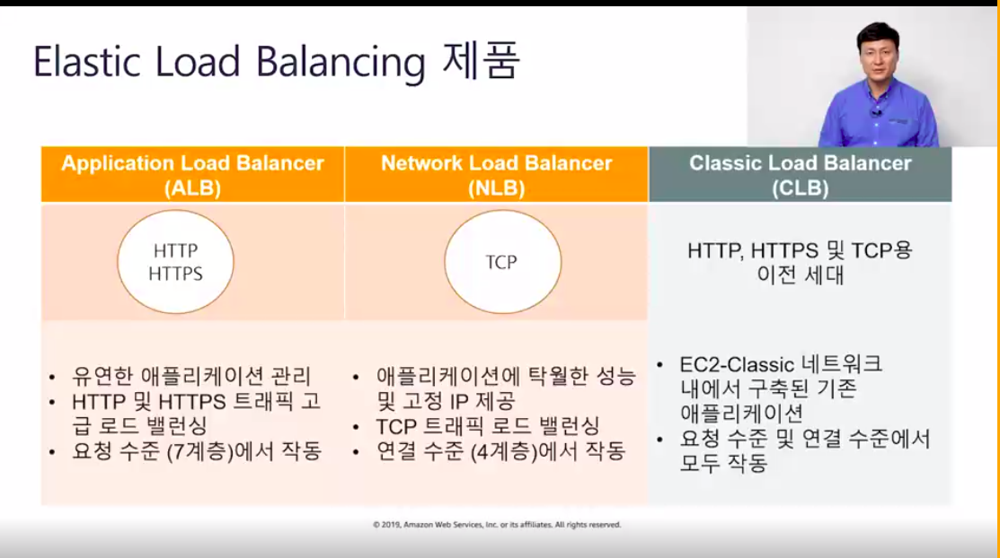

#### Aws 5.30 AWSOMEday 조재구님 강연 
[전체 슬라이드](https://www.evernote.com/shard/s372/sh/6db782a7-5f86-487e-9c41-195d443c0c01/f96b827b1f76f9ed8cca5cf70c1b47ad)  

**목차**
```
1. AWS 클라우드 개념   
2. AWS 핵심 서비스   
3. AWS 보안   
4. AWS 아키택처 설계(실례 x 어떤 관점으로 해야하나.)        
5. AWS 요금 및 지원    
```
  


# 강의 2: AWS 핵심 서비스  

## Aws 글로벌 인프라 
### **리전**  -> 두개이상 가용영역 호스팅 하는 지리적 영역.    
(비용, 규제 등 고려 최적화 하려 해야함. 본사에 가장 가까움 ~ 고객에 가장 가까운. 지연시간 최소화, 민첩성 . 완전 독립되서 다른 리전으로 자동 복제 x)   
리전 표 통해 리전별로 지원하는 서비스 확인 해야함.   

### **가용영역**   ->  특정 리즌에 존제하는 데이터 센터.     
물리적으로 분리. 네트워크 연결되어 있다.   
장애 발생시 서로 가용영역 서로 격리 되어 있어서 복구 가능.   
별도의 무정전 전원,장치 보유.   
서로 격리하면 장애로 부터 서로 보호 가능. 다른 영역으로 요청 처리 가능.     

### **엣지 로케이션** 
clouud front   -> 컨텐츠를 고객에 전송하는데 사용 (가장 가까운 엣지 로케이션으로 ~ 보다빠른    
route 53  
aws shield   
aws web application firewall   
lambda @ edge 컴퓨팅   
인구밀도 높은 곳에 있음  . 


### **Amazon virtual private cloud (VPC)**  
AWS클라우드 내 프라이빗 가상 네트워크   
온프레미스 네트워크와 비슷한 구조   
네트워크 구성에 대한 완벽한 제어. (서브넷 라우트 테이블등 일반 네트워크 항목 제어 가능 )   
**배포**     
보안 제어 계층 추가 하기 위한 방법으로 배포 가능 ( 서브넷 격리, 엑세스 제어등 .. 송수신 트레픽 거부 결정등 제어 가능 )   
다양한 서비스들과 통합된다. ec2, rds, 등과   
**특징**    
리전및 가용영역의 aws인프라를 기초로함.    
클라우드에 호스팅 되는 가상 네트워크를 프로비저닝 하도록 허용   
리전내에 상주함.  
논리적으로 격리됨.  
여러 서브넷에 의해 분할되는 하나의 ip 주소를 정의한다. ( 서브넷 적계 생성이 권장 되긴함. )     
서브넷과 인터넷 사이의 트래픽 제어 위해 라우팅 테이블 구성     
vpc내 서브넷은 서로 모두 통신 가능     
서브넷 -> 퍼블릭 (인터넷에 직접 접근 가능), 프라이빗 (x)    
(서브넷 퍼블릭 설정위해 인터넷 게이트 웨이를 vpc에 연결후 로컬이 아닌 트레픽을 인터넷 게이트웨이로 전송하도록퍼블릭 서브넷의 라우팅 테이블을 업데이트 해야함.)    


### **AWS 보안**   
최우선 과제중 하나.   
보안그룹.-> 내장 (가상) 방화벽의 역할, 인수톤수에 대헌 액세스 제어.    

   
다양한 보안그룹 생성됨. 
인터넷 -> 웹티어  -> 엡티어 -> 데이터 베이스 티어    
**웹티어** 0.0.0.0 -> 모든 유저 인터넷 통해 들어옴.  
보안그룹 통해 0.0.0.0 모든 호스트가 몇번 포트 80, 443 등 통해 인터넷 으로 들어오는 모든수신 트래픽 하도록 선언함.   
**엡티어**   
모든 인터넷 사용자 바로 엡티어 안들어오고   
웹서버 티어에서 들어오는 트레픽만 허용 하겟다 선언할 수있음   
**데이터베이스 티어**     
바로앞의 엡티어로 부터 오는 트레픽만 받겠다 선언 할수 있음.       

또한 ssh포트 25번 설정 해서  기업 에서 관리 목적으로 보안그룹 규칙 생성 가능.     


### **컴퓨팅 서비스**  
에플리케이션 서비스     
가상 프라이빗 서버     
서버리스 컴퓨팅     
amazon lightsail -> 가상 프라이빗 서버 시작. 간편한 웹 및 에플리케이션 서버 관리   
amazon ecs -> 관리형 컨테이너, 뛰어난 확장성.  
aws fargate -> 사용자가 서버, 클러스트 관리 안해도 됨.   
amazon eks  -> 자체 쿠버네틱스 서버 설치 필요 없이 aws 에서 컨테이너 실행 가능   


### **ec2** 
elastic compute cloud  탄력적인 컴퓨팅 클라우드.  
서버수량 필요따라 자동 증량 가능.   
**만드는 과정.**
```
인스턴스는 특정 네트워크의 특정 서브넷에 할당 되어야 한다.    
퍼블릭 ip 자동 할당. -> 활성화   
2가지의 ip생성됨.   
퍼블릭 -> 인터넷 통신 가능한 ip  
프라이빗 아이피 ->인터넷 통신 불가능한 ip   

4단계 : 스토리지 추가 - > ebs볼륨. 인스턴스 규모 따라 다름. 
5단계: 테그 추가 
6단계: 보안그룹 ->인스턴스로 들어오고 나가는 규칙을 생성. 유형, 프로토콜, 포트 설정. 
                            유형 ssh는 모든 아이피 안되고 관리자만 들어갈 수 있게 해야됨 -> 내 컴퓨터 아이피만 추가함. 
                            내가 인스턴스를  웹서버 용도로 만든다면? ->웹에서 들어올수 있느 설정 해줘야함. 
                             http로 접근 하는 경우  -> 프로토콜 tcp, 포트 89, 소스 -> 위치 무관으로 어느 사용자나 들어와야함. -> 0.0.0
                              여기 포함된 다른 방법으로 인스턴스 접근 하려 하면 전부 차단됨. 

키페어 생성? : 생성된 ec2내부 운영체제의 rooid에 대해서 미리 만든 .키페어로 인증해서 사용가능. 
                       키패어 생성시 내 컴퓨터에 pem형태로 적당한 위치에 키페어 만들어짐 
                       running상태 -> os 내부 부팅 등. 상태감서 탭- > 초기화 단계....

퍼블릭 ip -> ssh로 인터넷 통해 접근할 수 있는 ip 
                  이것 바뀔수있다. 인스턴스 중지하고 시작하게 되면 바뀜. 
                  이것 바꾸기 싫다면 고정 아이피. 탄력적 ip를 적용하면 된다. 
                   탄력적 ip를 이 인스턴스에 고정 ip로 설정 가능한것.   
```
퍼블릭 ip로 접속해서 여러가지 작업 진행 해 볼 수 있다.  
인스턴스 설정 -> 시스템 로그 가져오기.(부팅시 로그 정보 관람 가능.), 스크린샷 가져오기 가능.  
( 현제 콘솔화면 새로고침 해보기 가능 )    
연결 눌러보면 -> 연결하는 방법 설명 되어 있음.   


### **Elastic load balancer**  
관리형 로드 밸런싱 서비스   
인스턴스 간에 로드를 분산.    

**3가지 유형**  
  
```  
alb  -> http, https,지원.  -> 다양한 시나리오 에서 적용가능. 
           서로다른 요청 을 동일한 인스턴스로 라우팅 하되 
           포트따라 다른 경로 지정할 수 있다. 원하는 엡으로만 트레픽 분배 가능  
nlb  -> 초당 수백만개 처리 가능.매우짧은 지연시간.
clb -> 기본 로드 벨런싱.
```  
**alb사용사례**   
  
**alb**가 어떻게 백엔드 대상을 라우팅하고 구성하는지?   
로드벨런서에 대해 리스너를 구성할때   
로드밸런서가 수신하는 요청에 백엔드 대상으로 라우팅 되는 방식을 지정하는 규칙을 생성한다.  
규칙을 로드밸런서에 등록, 로드밸런서가 대상에 사용하는 상태확인을 등록 하려면 대상그룹을 생성한다.   
대상은 여러 대상의 그룹의 맴버가 될 수 있다.   

**nlb**사용 사례   
가용영역당 하나의 고정 ip를 사용하면서   
급격하게 변동하는 트래픽 패턴 처리에 최적화 되어있다.   
초당 수백만개의 요청을 처리. -> 매우 짧은 지연시간 유지 가능  -> 뛰어난 성능 필요한 에플리케이션에 적합.   

**clb**사용 사례   
노출된 단일 엑세스 포인트를 통해 웹서버에 대한 엑세스를 보호   
애플리케이션 환경을 분리   
인터넷 및 내부 로드 벨런서를 둘다 사용,  
트래픽을 여러 가용영역으로 분산 -> 고가용성및 내 결함성 제공,  


### **autoscaling**  
에플리케이션의 로드를 처리하는데 사용할 수 있는 적정수의 ec2인스턴스 유지하는데 도움됨.     
향후 특정 시점에서 워크로드 요구사항 충족하기 위해 몇개 ec2필요할지 추측할 필요 없다.     
ec2인스턴스에서 에플리케이션 실행할때 cloud watch 사용해서 워크로드 성능 모니터링 하는게 중요함.    
cloudwatch자체는 ec2추가 제거 못함 -> ec2 auto scaling 이 등장.     
각 요일별로 수요 다름을 보고     
미리 자원을 적절히 확보해놓음. ->수요일 맞춰 5개, 월요일 맟춰 1개 용량을 프로비저닝 함.   
확장성과 자동화 둘다 잡음.    
그럼 이런 조정이란 정확히 어떤의미인지?  
확장 및 축소란?      
오토 스케일링은 사용자가 설정한 (cpu사용량 80프로 이상등의 ) 조건 따라, 일정따라   
ec2인스턴스 수 자동으로 조정 가능.  
사용자가 이러한 이벤트에 트리거를 설정한다.   
**auto scaling 구성요소**   
```
시작구성, autoscaling그룹, autoscaling정책  
```   
**시작 구성 (무엇을)**      -> ami(아마존 머신 이미지)  인스턴스 유형, 보안그룹, 역할 -> ec2만들때 지정하던 모든것   
**autoscaling그룹(어디에)** ->  배포 위치, 배포 정의. ( vpc, 서브넷, 로드 밸런서, 최소,최대 인스턴스 원하는 용량 )   
**autoscaling정책 (언제)**  -> 언제 ec2인스턴스 시작하고 종료할지 (일정 ,온디맨드, 조거 기반 -> 확장축소정책 -> 동적으로작동하도록. )   

**동적 auto scaling  어떻게동작 되나?**   
ec2인스턴스,or 로드 벨런서 성능 정보 기반으로 클라우드 워치 생성.   
성능 임계값 클라우드 워치가 모니터링 해서     
오토스케일링 의 이벤트를 트리거.    
auto  scaling용 클라우드 워치 경보 -> cpu사용량(퍼센트), 몇분연속,/ 조치 ->인스턴스 추가or제거   
종료하기위해선는 (축소하기위해서는) 클라우드 워치 하나더 필요.    


### ebs볼륨 
ec2에 디스크공간 필요할때.  
ssd,hdd  
내구성 있으며 자동으로 복제됨.(블록 수준 복제라 아주 뛰어남.)   
성능 및 요구에 적합한거 써라 -> db(빠른 반응)    
스냅샷(특정 시점 스냅해서 공유 가능) ,  
암호화(EBS 오갈때 암호화 가능) ,  
탄력성 (인스턴스 종료 안하고 확장 가능 )   

그밖에 s3, rds, dynamodb ppt참고  

# 강의 3: AWS 보안  
aws trusted adviser -> 모범 사례     
규정준수 궁금하면 -> 규정준수 솔루션 안내서     


# 강의 4: AWS 아키텍처설계   
```
5개 원칙 맞춰 설계   
```   
## 1.보안
-> iam, 탐지, 인프라보호(무단침입방지. 위해 게이터웨이등 생성),   
데이터 보호 (백업, 전송 보호, 백업등 ),인  
시던트 대응 ( 복구 작업 잘 수행 하도록. )   

**보안 원칙 설계 원칙**    
모든 게층에 보안 구현.   
최소 권한 만 부여.   
os등 시스템 보호에 집중.   
자동화   
  
## 2.안정성 원칙   
장애로 부터 복구 중점.   
수요 충족하는 기능.    
(기반, 변경, 장애 에 대해 시스템 설계 시 고려 해야함.)  

**안정성 원칙 설계 원칙**    
복구 절차 테스트 ,  
자동 복구,  
수평확장(작은 부분이 큰부분영향 안미치도록 해야함.)     
자동화 변경사항 관리 (자동화된 변경부분만 신경 씀녀 됨?)      

## 3. 성능 효율성 원칙.    
가장 적합한 솔루션 선택해야함.      
최신 솔루션 항상 검토해봐라.    
cloud watch, lamda 등 통해  
   
**성능 효율성 원칙. 설계원칙.**   
고급기술 대중화. 전세계 몇분만에 배포. 서버리스 아키택쳐 사용.   
실험 빈도 증가(가상화로 테스트 빠르게 실행.) , 기술적 동조 (가장 적합한 기술 사용)    

## 4. 비용 최적화 원칙   
낮은 비용으로 최상의 퍼포먼스.   
모든것 쓰더라도 최소비용.   
수요에 맞춰 공급 (탄력적으로 자동조정. 수요따라 알림받아)   
**비용 최적화 원칙: 설계원칙.**   
소비모델 채택 . 효율성 측정, 지출 속성 파악 분석 가능하다. ->리소스 최적화 가능.   
관리형 서비스 사용.(이메일전송 디비관리등 작업에 대해 서버 유지비용 줄여줌.)  

## 5.운영 우수성 원칙   
변경 관리 및 자동화.     


## 내결함성   
시스템 작동 가능 상태 유지 할 수 있는 능력.   
에플리케이션에 내제된 중복성.  
  
## 고가용성   
항상 작동, 액세스 가능한 상태 유지.     
가동 중단을 최소화.     

## 탄력적 로드 밸런서   
긴 지영, 과도 사용시 사용자에게 알람 가능.   

## 탄력적 ip주소   
엡내 높은 내결합성 .지원.  

## 고정 ip주소.   
같은 ip가진 컴퓨터 사용할 수 있게 함 .  
장애 발생 해도 엡에 고객이 그대로 접근 가능   

## 라우트 53   
도메인 -> ip주소 변환 가능.   
단순 라우팅. 지연시간 기반 라우팅   
고객의 ~가용성 높임    

## 오토 스케일링   
인스턴스 종료 및 시작.   
온디맨드로 새 리소스를 생성.   

## amazon cloudwatch     
분산통계 수집 시스템.  
엡, 사용자에 대한 초고한 지표. 측정.   

## 내결합성 도구 
amazon simple queue service (sqs) -> 대기열 상시 가용 상태로 유지 가능    
amanzon simple storage servise (s3) 한리전, 여러 시설, 여러 디바이스에 중복 저장해서 언제나 접근 가능 .   
amazon simple db 고가용, 내결합 . 단일 장애 지점 방지 가능   
rds 관계형 db관련 쓸수있는 도구.     
다중서버 , 스넵샷 등 사용 가능 . ->높은 안정성, 내결합성, 고가용성 갖춤.   

## 웹호스팅 
비용 효율적 대안.   
인프라, 아키텍처 , 비용 관련 등에 대한 공통적인 솔루션 제공하고 있다.   
ex)  피크 및 대규모 고객 에 대한 대책 -> 기존에는 미리 프로비전으로 비용 많이 썼지만 aws에서는 온디맨드 프로비저닝으로 낭비되는 용량 제거 가능. 5시에 가장 바쁘다면 해당 시간에 필요한 만큼 프로비저닝 가능. 비용 50프로 이상 절감 가능.     
**확장성** .  
트레픽 예기치 않게 급증하는 경우.   
새로운 호스트 시작하고 준비 가능  

다양한 환경을 위한 온디맨드 솔루션.    
테스트 플릿을 프로비저닝. 필요할때만 - > 비용 감축.     
로드 테스트중. 사용자 트래픽 시뮬레이션 가능.       

기존 아키텍쳐를 aws로 옮기기로 했다면.  
aws로 마이그 래이션 ......  

### 주요 아키텍쳐 관련 고려사항.   
물리적 네트워크 어플라이언스 를 소프트 웨어 솔루션으로 대체됨.  
모든 곳에 방화벽 배포 ( 더 안전하게 ~ 모든 호스트 막아놓음. 모두 허용하는 보안그룹 설정 가능. )    
aws사용하면 호스트 임시적이고 동적인 것으로 인식됨. -> 유연하게 생각해야함.   
서버리스 (람다)등 사용하며 가상 머신 없이도 웹 어플리 케이션 생성 가능 ->사용자 요구로 엡 생성됨.   


# 강의 5: AWS 요금 및 지원 
```
요금 기본정보 
요금 내용
총비용 계산 
```

## 요금 기본 정보 
사용한 만큼.   
예약하는 경우 지불 비용 감소   (ec2, rds경우. 최대 75절감. <전체선결제,->가장 큰폭 할인 ,  부분선결제, 선결제없음>  )   
더 많이 사용할수록 단위당 더 적은 비용 지불.    (s3, ec2등 .스토리지 서비스 옵션 .   
AWS규모 커짐에 따라 더 적은 비용 지불.    
사용자 지정 요금     
프리티어     
   
### 추가요금 없음  
```   
aws  vpc,
aws  elasticbeanstalk
aws  cloudformation   -> 리소스 모음 생성. 프로비저닝 해줌. 
aws  iam  리소스 대한 사용자 엑세스 제어 
aws  scaling  ec2자동 추가및 제어. 유저 수요 따라 
aws  opsworks  엡을 간편하게 배포 하도록. 
```   
 
aws 기초 특성에 대한 비용 지불.  
아웃바인드 데이터 전송에 대한것 vpc차원에서 합쳐서 계산? (놓침.)    

## ec2 
간편하게 용량 구성 및 완전한 제어권 제공.   
실제 사용한 용량에 대해서만 요금 부과.     
**1.클록-초 시간당 청구.** 리소스가 실행되고 있을때만 요금 발생.     
(탄력적 ip설정 및 해제 )    
**2.인스턴스 구성.**    
용량, aws리전, 운영체제, 코어수, 메모리     
--> 온디멘드 인스턴스 , 예약 인스턴스, 스팟 인스턴스  ->미사용 ec2용량 입찰.   

오토 스케일링 자체는 비용 x , 늘어나는 ec2에 대해서는 비용 발생.  
loadbalancing에 대해서는 비용 발생  -> oo 로드벨런싱 실행 시간 만큼 과금.     

ec2모니터링에 비용 발생. 클라우드 워치 기본 으로는 몇분 쓸 수 잇긴함. 

Autoscaling  -> 추가 비용 x    

탄력적 ip  -> 한개까지 무료    

인스턴스 가격에 ibm ms 등 소프트웨어 가격 포함 되어 있음.   


## amazon s3 
스토리지 클래스 따라 요금 다름   
가용성 다르고 , 내구성 같다.   
스탠다드 스토리지   
스탠다드 (sia) -> 가용성, 낮지만. 비용 절감 가능     

비용 추정 고려사항.   
객채 수 및 크기   

요청   
요청 수 요청 유형 따라 다름 (get)  
s3 리전에서 송신된 데이터의 양을 기준으로 부과됨.   

## amazon ebs   
ec2와 함께 사용하는 블록수준의 스토리지.   
클라우드 상 가상 디스크와 유사.   
인스턴스 중지되도 ebs볼륨은 유지가능.   
범용ssd, 프로비저닝된 iops, 마그네틱등 세가지 볼륨 유형 제공.     

볼륨. -> 매월 프로비저닝 되는 용량에 따라 부과   

iops 
범용 -> 요금 함께 포함.(1기가 사용시 3 iops .. 볼륨따라 포함됨 )   
마그네틱 ->  볼륨에 따라 수행디ㅗ는 요청 따라 부과   
프로비저닝된 iops(ss) - > 프로비저닝된 iops따라 부과    

스넵샷 비용   
데이터 안정적으로 복구 하는기능.   
월별 gb당 금액 추가됨   

데이터 전송 비용.   
인바운드 데이터 전송 무료   
아웃바운드는 계층화 되있어서 ~따라 달름.   

## Amazon RDS   
클라우드에 있는 관계형 디비   

클록 시간 청구 ->리소스 실행되고 있을때만(디비 인스턴스 실행 중일때만.  
데이터 베이스 특성 - > 물리적 용량 (엔진, 크기 메모리 클레스)    

ec2와 비슷한 구매 유형.   
온디멘드, 예약 데이터 베이스 인스턴스.   
피크로드 처리 위해 여러 디비 프로비저닝 가능.     

프로비저닝된 스토리지   
최대 백프로 해당하는 백업은 무료   
  
추가 스토리지.   
월별로 요금 부과     

배포 유형 및 데이터 전송.   
스토리지 및 io요금 ->단일 가용영역, 다중 가용영역   
인바운드 무료 , 아웃바운드 는 각각 다름     


## cloudfront   
콘텐츠 전송을위한     

지리적리즌, 엣지 로케이션 따라 요금 다름.   

요청  
요청 수/유형 지리적 리전.  

데이터 송신   
송신된 양 따라 다름.    


## 총 소유 비용 계산기 사용.   
AWS TCO 계산기   
기존 -> aws 이주시   
현제 발생되는 비용에서 얼마나 절감되나 효과를 추정 계산 가능.   
세부 보고서를 제공.   
가정을 수정.   

## aws support   
도구와 전문성의 고유한 조합을 제공.   
aws support  
aws support플렌   

지원하는 고객 범위 -> 모두 지원.   
aws로 실험.  
aws를 프로덕션에 사용   
aws를 비지니스 크리티컬에 사용 .   

aws support   
선제적 지침 -> 기술 지원 담당자 (TAM)  지침 , 아키텍처 점검 하게 해줌.   
모범 사례  -> Trusted Advisor (모범사례 따를수 있게 해줌. 월별 지출 줄이고, 생산성 줄이는 것 확인 가능한 온라인 지침 )   
계정 지원   
aws support 컨시어지 (기술과 관련없는 결제,관련 )    

4가지 support플랜   
basic support   
developr support  
business support  
enterprise support    

​


```
채팅 로그 보안 ~~~ 
재민 김:
책임을 지는 영역을 구분짓겠다는 소리같아요. 비율을 정확히 나눈다기보담도..
seungmin choi:
시큐리티 그룹에서 인바운드 규칙을 설정이 방화벽 설정한거라고 볼수있는건가요
상택 정:
네. 0.0.0.0은 열어두시면 절대 안될 거 같아요
영기 김:
보안그룹도 둘수있고 상단에 방화벽을 만들어서 둘수도 있겠죠
상택 정:
https가 아닌 이상은 굳이 0.0.0.0은 deny
명석 신:
근데 AWS DNS서버 장애 나는경우는 자주있어서요. 슬슬 초창기에 도입한 서버들이 고장나기 시작하는듯두요
영기 김:
물론 돈은 들겠지만
상택 정:
그리고 그냥 계정 자체를 match로 막아두셔도 되고요
상택 정:
어차피 키스토어 있으니 뭐 괜찮겠지만
보근 김:
방화벽 역할은 크게 Network ACL, Security Group
상택 정:
2factor로 otp 넣어두고
Arena Son:
cloud flare 보통 쓰지 않나요?
seungmin choi:
@영기 김 ; 상단에 방화벽을 만들어서 둘수도 있겠죠 / 조금더 설명 해줏실수 잇으신가요
보근 김:
2 개로 할 수 있는데, Security Group으로만 하니 더 작은 범위의 IP 제한이 안되서, N-ACL도 이제 함께 IP 조절에 사용해볼까합니다
영기 김:
aws는 잘모르는데 azure는 방화벽을 만들어서 둘수 있어요
영기 김:
보안그룹은 ACL 기반인거고
상택 정:
Network ACLs - Amazon Virtual Private Cloud
상택 정:
이것도 비슷한건가요?
수철 김:
시큐리티 VPC 를 만들어서
보근 김:
VPC를 설정하면 기본적으로 N-ACL 설정이 동반되게 됩니다
수철 김:
인터넷 게이트웨이를 그쪽에 연결하고
수철 김:
거기에 UTM과 WAF를 두고
Tony Lee:
aws도 데모보니 있던거 같더라구요 강의2에서
seungmin choi:
@보근 김 : 더 작은 범위의 IP제한은 어떤것들인거죠?
수철 김:
다른 VPC에 환경 구성한다음
수철 김:
Peering으로 연결 하는 방법 있습니다
보근 김:
누군가 해킹을 위해 고정된 IP로 대규모 요청을 한다고 할때
남용 김:
어라 멈춤이
상택 정:
챕터 2는 단일 인스턴스 IAM이랑 Gateway고, 전체 아키텍처로 분산하려면 가상 방화벽 역할을 하는게 있어야 할거 같아요
보근 김:
해당 IP를 차단할 경우가 생기는데 Security Group에서는 인바운드 설정이 전체 차단 > 허용 형태로 수행되기때문에
보근 김:
N-ACL 에서 정책 우선순위에 따라 특정 IP만 접근 차단할 수 있습니다
보근 김:
다만, 적용 범위가 서브넷단위라
명석 신:
좀더 어플리케이션 단 얘기긴하지만 웹서버인 경우 WAF를 쓰면 DDOS가 있더라도 어느정도는 막아주는거 같더라구요. 물론 발생된 트래픽은 과금되지만.
성준 하:
명석 신 // 이거 궁금했었는데 감사합니다
현우 강:
DDOS 에 대한 트래픽 과금도 있는건가요?
명석 신:
넵 과금되는 걸로 압니다. 대신 DDOS공격에 대한 방어는 되겠지요. 서비스 다운은 방지되니깐요 .
정우 반:
트래픽 사용량만큼 과금하니
현우 강:
그렇군요 ㄷㄷ..
명석 신:
예전엔 유료였는데 요새는 스탠다다는 무료?맞죠?
정우 반:
aws말고 다른데도 그럴껄요 ㅋㅋ
명석 신:
저도 예전 고부하 테스트 할때 한번 써보고 말아서 요즘 확실하진 않네요 .​
성준 하:
지금은 1백만 건당 0.6 USD네요
승원 장:
컥 Ddos 공격 당하면 과금되는게..​
보근 김:
해당 강의는 실질적인 인프라 설계 모델에 대한 내용이 아니라, 설계 원칙에 대한 내용이었군요
성구 권:
ㅇㅅㅇ..dns 장애로 전체 멈췄던적 있지 않나요..
주현 장:
아 크라우드프론트 쓰면 과금이 되는거군요.
명석 신:
DNS서버 장애는 자주 있었어요. 서울리전에서는 좀 크게 난거 같지만 .
보근 김:
AWS Shield Advanced를 활용하면 DDos 트래픽에 대한 비용 보호 제도가 있다고 합니다
명석 신:
스탠다드말고 유료인 어드밴스가 있었네요 .
명석 신:
보험가입한다 치고 가입하면 괜찮을거 같네요​
재민 김:
고정비용인가요?​아니면 조건에 따라 비용이 달라지는 건가요?
명석 신:
https://aws.amazon.com/ko/shield/pricing/
명석 신:
고정인듯 싶기두 하네요 ..​
재민 김:
1년치를 한꺼번에 결제하면 3천불 인거 같고​
재민 김:
초과4PB 이상부터는 문의처라고 되어 있네요​
보안운영하면서 데이터센터 아키텍처를 알고 있는 상태에서 이 강의들을 들으니 아 데이터센터에 AWS를 어떻게 적용할 수 있곘구나를 알아요​
​
 챼팅 로그   요금 ~ 
명석 신:
일단 온디멘드로 시작하다가 장기로 가면 예약 인스턴스로 넘어가면 되는거 같아요.
프리티어 버전 1년 넘으면​
영수 유:
기존에 있던 인스턴스는 삭제 되나요?
주현 장:
간단한 테스트는 본인 VM에서 구축해서 테스트하는걸로...
영수 유:
연장할 수 있나요?
이태 정:
elastic beanstalk 가 어떤용도엿엇죵 ...?​
AWF advanced 기본요금만 있는줄알았는데 추가로 아래 데이터 사용요금 있었네요 .기본요금 + 데이터사용량 ^^;;;​
명석 신:
가용성 0.09프로의 차이가 얼마나 될지 감이 안오네요 ㅜㅜ​
계홍 박:
@명석 신 : 아마도 데이터를 3군데에 복사해 놓지 않고 2개에 복사해 놓는 그런 식일꺼에요.
명석 신:
아하 분산리스크관리적인 비율이군요. 감사합니다!​
명석 신:
RDS를 별도로 두는게 나을까요. EC2에 직접 넣는게 나을까요.. RDS가 눈에 보이니깐 관리는 쉬워보이는데 ..RDS에서 기본제공되는 DB라면 RDS쓰는게 낫겠죠?​
계홍 박:
RDS 가 비용안 비싸고 디비 데이터 보호에 아주 좋다고 하더라고요.​.
남용 김:
rds 쓰는게 HA 까지 하다보면 더 나을꺼 같아요
seungmin choi:
본안 백업 등등의 관리를 모두 할수있다 라면 ec2에
석주 이:
따로 두는게 모니터링에도 좋은것 같아요
seungmin choi:
귀찬다 rds
현준 조:
아 근데 비용 너무 복잡하네요
명석 신:
하긴 관리가편하니깐 RDS가 낫겠네요 . 회사에서 비용부담만 안되면요 .. 좀더 안정적이겠네요 .
남용 김:
돈만 내면 됩니다 ~~!!! ㅠ.ㅠ
남용 김:
귀찮게 설정 안해도 되는게 최고 장점이니
계홍 박:
rds는 데이터가 정말 많지 않으면 한달에 2-4만원 정도만 되도 된다고 하더라고요.​
명석 신:
항상 비용이 RDS가 제일 많이나오거든요
명석 신:
그래서 고민해 봤음당.
seungmin choi:
디비가 요금이 더나오네요
명석 신:
EC2는 고만고만하구요 .
진현 정:
IDC에서 클라우드로 전환한 경우 5년정도 TCO로 절감이 많이 되나요?
계홍 박:
아 그런가요. rds 가 많이 나오는 군요.​
남용 김:
뭘 하더라도 디비 트래픽은 발생할테니 많이 나오는게 당연하지 않을까요???
남용 김:
급 응가라서 휴대폰 키고 이럴 여유가 -ㅅ-;
명석 신:
r5.large라 그리 크지않은거 쓰고 있는데 제법나오요 (reader writer구성 )
TAEDONG HAN:
근데 저거 비용계산하려면
TAEDONG HAN:
아키텍쳐를 좀 알아야되요
남용 김:
근거값을 알아야 수치를 넣을텐데 --;
명석 신:
넵 그런거 같더라구요 .
TAEDONG HAN:
온프레미스 환경에 있는 실제 물리 데이터센터 서버들 굴리는 가격을 알아야되요
명석 신:
청구서에 가격예측하는 화면은 자주봤는데 .
TAEDONG HAN:
항온항습기 전기세랑 서버돌아가는 전기세 사람인력비용 다 따져야되요
TAEDONG HAN:
AWS 서포트!!! 이거​중요합니다.​뭐 안되거나 잘못됏을때 무조건 연락해서 지원받아야됩니다.​
TAEDONG HAN:
aws support는 그냥 고객지원이에요 ㅋㅋㅋ 운영자한테 메일보내는거
명석 신:
프리미엄 회원이었는데 aws 서포트로 할때 24시간 안에 대답해주긴합니다​
계홍 박:
서비스 만들려고 했더니 상담을 잘 해주긴 하더라고요. ^^
명석 신:
회사에서 든거라 .
명석 신:
근데 시간은 걸리는데 전문적인 요원이 답변 잘 해주더라구요​
석주 이:
전체적인 아키텍처 구성도 도와주나요?
계홍 박:
네 맞아요. 회사 서비스 쓸때는 상담 받고 쓰는게 제일 좋은 듯 해요. 관련 파트너사 연결도 해 주고.
명석 신:
네 전반적인 조언 다 해줍니다.​
명석 신:
개별적인 소프트웨어 고객센터보단 낫습니다.​
계홍 박:
aws 관련 전문 파트너사도 아주 많은 듯 해요.
석주 이:
여태 들은 서비스중 제일 강력한 기능이네요
TAEDONG HAN:
오 그런것도 봐주나보네요 프리미엄은
준호 최:
TAM이면 마이크로소프트랑 비슷한건가....
명석 신:
자바 오라클(오라클) 이런데 개별적으로 컨택하는거보단 나아요
명석 신:
다만 상황설명을 해야하니깐 최대한 자세하게 적어야지 그에 따른 답변이 날아오니 시간이 많이걸려요..
​
​
​
​  
```
