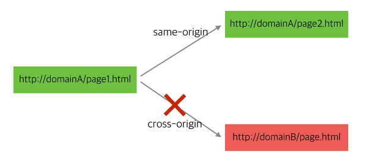

# CORS

보안상의 이유로 도메인이 다른 경우 호출을 제한하는것.   
cross-site-http-request를 가능하게 하는 표준 규약.    

웹 브라우저에서 외부 도메인 서버와 통신하기 위한 방식을 표준화한것.   
서버와 클라이언 트가 정해진 해더를 통해 서로 요청이나 응답에 반응할지 결정하는 방식.   
교차 출처 자원 공유(cross-origin-resource\_resource\_sharing)   

## 순서   

**사전요청 preflight request**  
요청하려는 URL이 외부 도메인일 경우 웹 브라우저는 preflight요청을 먼저 날린다.  
실제 요청하려는 경로와 같은 URL에 OPTION메서드로 요청 미리날려 요청 할수있는 권한 있는지 확인한다.  --> 이에 대해 해당 서버측에서 추가적으로 처리할것이 있다.    

**서버에서 cors 요청 핸들링**   
서버로 날아온 preflight요청을 처리하여 웹 브라우저에서 실제 요청을 서버로 날릴수 있도록 처리해준다.     
preflight요청을 받기 위해 OPTIONS 메서드의 요청을 받아 컨트롤 해야함.   
모든 요청의 응답에 아래 해더를 추가한다.(이거 아래 aws s3때 했던것 같음)   
```  
Access-Control-Allow-Origin: *  
Access-Control-Allow-Methods: GET,POST,PUT,DELETE,OPTIONS
Access-Control-Max-Age: 3600
Access-Control-Allow-Headers: Origin,Accept,X-Requested-With,Content-Type,Access-Control-Request-Method,Access-Control-Request-Headers,Authorization
```
다음과 같이 웹브라우저의 스크립트엔진에서 보낸 preflight요청에 대한 응답으로 Access-Control-Allow-Origin 에 * 이 있으면 모든 도메인에서의 요청을 허용하는 것으로 판단한다.      

[출처](https://brunch.co.kr/@adrenalinee31/1)


## s3 쓸때 봤던  cors    

```
heeadtab의 링크 newtab에서 들어가서
주소창 https://fc-8th-deploy-mr.s3.amazonaws.com/static/admin/css/fonts.css 인증문자열 지우고 들어가면 들어가진다. 
왜 콘솔에서는 애러가뜨나?
폰트를 from -orign http:localhost:8000 으로 부터 가져오려 했는데 CORS policy를 위반해서 블록됬다고 나온다.

S3 해당 버킷 폐이지의 권한-->  CORS 구성 가본다. 
(CORS란?
localhost도메인에서  이 도메인 에만 있는 이미지 가져오는 것이 아니라 다른곳의 이미지 링크걸 수 있다.
다른 곳에있는 스크립트 가져올때 악성 자바스크립트 삽입 가능해서 제한한다.
cross-orgigin HTTP요청을 제한한다 한다. --------->스크립트 내에서 초기화 될때 제한된다.
우리같은 경우는 css에도 그것이 먹혀버린것. css 안에서 앞서 본것처럼 다른 링크 불러와서. 그것이 막힌것.
이런것 때문에 새로운 매커니즘 CORS[Cross-origin Resource Sharing]을 권장한다. 
이 규칙에 맞도록 서버에 설정을 해줘야한다. 
우리의 리소스 서버 s3은 우리가 만든것이 아니다. (우리가 만들었으면 서버에서 직접 해줘야한다.  request response마다 각각)


```
[aws s3 cors참고](https://docs.aws.amazon.com/ko_kr/AmazonS3/latest/dev/cors.html#cors-eval-criteria)  

```
Amazon S3는 브라우저에서 preflight 요청을 받으면 버킷에 대한 CORS 구성을 평가하여, 수신된 브라우저 요청과 일치하는 첫 번째 CORSRule 규칙을 사용하여 cross-origin 요청을 허용합니다. 규칙이 일치하려면 다음 조건이 충족되어야 합니다.

요청의 Origin 헤더가 AllowedOrigin 요소와 일치해야 합니다.

요청 메서드(예: GET 또는 PUT) 또는 Access-Control-Request-Method 헤더(preflight OPTIONS 요청의 경우)가 AllowedMethod 요소 중 하나와 일치해야 합니다.

preflight 요청의 Access-Control-Request-Headers 헤더에 나열된 모든 헤더가 AllowedHeader 요소와 일치해야 합니다.

참고

버킷에 대해 CORS를 허용하면 ACL과 정책이 계속 적용됩니다.
```


## Django에서 CORS 에러 해결법    
[참고](https://ngee.tistory.com/1154)

## CORS ,와 Django의 allowed\_host차이점은?   
cors header 설치해서 white-list에 특정 도메인 추가해 놓는거랑 allowed host 에 도메인 추가하는거랑 뭔차인지? [참고중](https://stackoverflow.com/questions/47228488/django-allowed-hosts-vs-corsdjango-cors-headers )    
```
allowed_hosts는
debug=false되있는 배포 환경에서 장고 엡은 allowed_hosts에 명시 되지 않은 도메인에 대해서 serve를 하지 않을 것이다.이건 니 장고 앱이 서브 할수 있는 도메인에 대한 white_list이다.


cors는
반면에 프론트 엔드의 여러 앱들(reactjs)을 api서버가 배포된 도메인에 같이 배포 하지 않고도 너의 api 서버와 상호작요(요청 주고받고)할 수 있도록 하기 위함.
-> 그러니까 내가 내 프로젝트 내에서 여러 접근들 ~ 도메인들 (elasticbeanstalck aws 같은 배포와 관련된 도메인들 ) 에 대해서 허가 내릴 때는 allowedhost쓰고 배포 관련 없는 다른 별개의 프로젝트의 도메인을 관리 할때는 cors 쓰는듯.  

```   
