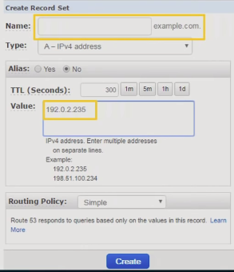
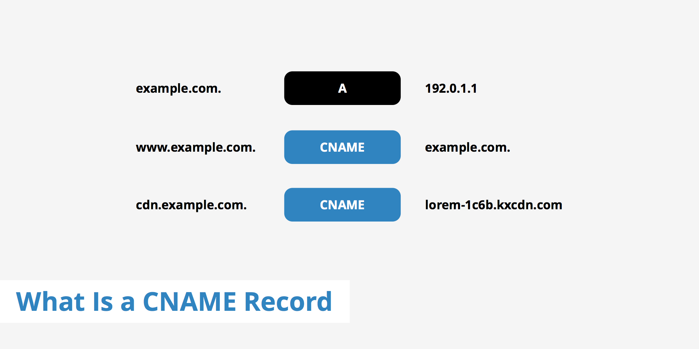

# DNS 서버    

#### 이전에 했던 필기들.        
  

```
1.User가 가장 가까운 DNS Server에 말걸음( ISP DNS Resolver라는 인터넷 제공업체에서 운영하는 DNS서버) 
  where is www.example.com이라는 쿼리를 해석해서 각 .으로 나뉘는 파트들을 체크해서 완전한 ip로된 응답 만든뒤 cllient-user에게 돌려준다. 


2.Resolver는 Root name server 에게 www.example.com에 ip 대해 아냐고 물어본다. 
 여기에는 (.com, .kr ,.uk )등에대해서 어떤 name서버가 아는지에 대해 기록되어있다. 
Rootnameserver는 Resovler에게 .com에 대해서는 .com server가 안다고 응답을 돌려준다. 


3.Resolver는 .com server에게 www.example.com에 대해 아냐고 물어본다. 
여기에는 (example.com, student.com, profile.com)등에대해 어떤 서버(DNS PROVIDER)가 아는지에 대해 기록되어 있다. 
.com server는 Resolver에게 example.com은 Route53이 안다고 응답을 돌려준다. 
( 어떻게 .com이 이사실을 알 고 있을까?  
  우리가 도메인 등록시 .com서버에  Route53이 이 example.com의 DNS Provider라는 정보를 업데이트 했었기 때문에 )


4.Resolver는 Route53에게 www.example.com에대해 아냐고 물어본다. 
여기에있는 hostedzone안에 ( www.example.com. bar.example.com)등에 해당하는 ip 기록되어있다. 

```

#### setting up DNS for basic website four steps  

```   

1.Register a domain name(도메인네임 등록) 
      route 53 안에서 등록하거나 다른 reigister등록 (우리같은경우 호스트kr) 


(route 53안에서 domain name등록시 2,3번 알아서 해준다. )
다른 domain register에서 domain name 생성시  다른 domain register에 name server라는것을 등록해 줘야한다. 


2.roughly freeze DNS interface( hosted zone을 생성한다.)
   hosted zone안에서 DNS records를 생성할 것이다. ( 트래픽을 특정 ip나 aws의 resource 으로 연결하는.)
 domain등록한대로 aws에 등록함면 --> 
    default로 hosted zone에  두개의 DNS record 생성되어 있다. 
먠 위의 Type NS 인 DNS reocord를 신경 써야 한다. 


ns-569.awsdns-06.net. 
ns-1149.awsdns-15.org. 
ns-1627.awsdns-11.co.uk. 
ns-468.awsdns-58.com.


이것들이 route53을 안의 hosted zone을 위한 구체적인 네임서버 이다.  ----------> 이 set들 을 너가사용하는 register에 등록해야한다. 
(모든 hosted zone은 고유한 네개의 네임서버 set을 가진다.)


3.point records at your server
(실제로 트래픽을 웹 서버로 전달하는 레코드 를 만들겠다. )


도메인네임 자체를 record로 만들 수 있다. (example.com) 이걸 root domain이라 한다. 
한단계 더 안에 만들 수 있다. (www.example.com) subdomain
혹은 어떤 이름이던 유저가 입력한 것 을 레코드로 만들 수 있다.   (wildcar record)


created record set 클릭 
```



```
우리는 example.com에 대한 record를 만들겠다. (이것이 너의 hostedzone이라서 이미 등록되있다.)


name :  rootdomain 사용시 비워도 된다. subdomain사용하고 싶으면 www. 등 입력해라. 
value:  여기에는 ip입력. 웹서버라면 웹서버 ip를 , aws의 resource사용시에는 alias클릭후 알맞은것 선택해 준다.  


(의문점. 나의 경우 www.api.yapen.com 과 www.yapen.com나누고 싶은데 
              drf사용 --> www.api.yapen.com, api.yapen.com-----> eb로 연결 
               django template view사용 -->  www.yapen.com, yapen.com---------------> ??????
                (정확히 어디로 연결?  우리  ec2 하나인데 ?  일단 여기로 연결하고  안에서 나눠쓰는건가 ? 
                ( 앞서서 인스타금에서는 www.yapen.com/api/                www.ypen.com/ 이런식으로 나눴는데 
                이번에는 앞에서 www.api.yapen.com이런식으로 나누고 싶은것 이다.
                문제는 이때 두경우다 똑같은 ec2로 가버리면 주소를 api라는 것을 붙여서 나눈 의미가 있는가 ? 
                 이럴거면 그냥 안나누고 인스타때처럼 뒤에서 나누면 된거 아닌가? )


        ----->아니면 그냥 api붙인것, ---->django -api project의 ec2 or container
                   안붙인것 ---->   frontend의 ec2 or container   이렇게 나누라는 뜻이었나 ? 


3.connect the domain name to the hosted zone (delegation, 위임 이라고 한다. )
너의 route 53의 hosted zone 에 맞는 name서버를 registarar를 업데이트 하는 


도메인네임을 route 53과 연결하는것. 
( 이렇게하면 route53이 그 도메인에 애한 dns traffic을 서빙한다. )


ns-569.awsdns-06.net. 
ns-1149.awsdns-15.org. 
ns-1627.awsdns-11.co.uk. 
ns-468.awsdns-58.com.


이 네개의 네임서버 셋을 delegation set이라 한다. 
너가 유닉하게쓰는 어떤것이다. 

```


## 생활코딩 보고 애매한 부분들 좀더 알아보겠슴.   

[생활코딩 DNS 강의](https://opentutorials.org/course/3276)   

#### ip 주소와 hosts 개념, hosts 파일을 설정하는법         

두게의 컴퓨터 통신 위해선 반드시 ip 주소 필요함.     
클라가 서버접속 위해선 서버의 ip, 서버가 클라에 응답위해서는 클라의 ip 필요   
네트워크에 연결된 컴퓨터 장치들  = hosts   
모든 운영체제에는 hosts  파일 있어서 특정 example.com --> 특정 ip 기록되어 있음     
이런식으로 DNS통하지 않고도 자주 사용하는 사이트,등에 호스트에 이름 부여 가능하다.   

한번 해보자.   
운영체제 별로 호스트 파일 달라서 알아봐야함.   
host wikipedia검색 -> 운영체제별 위치 보인다.       
linux경우 /etc/hosts    

이거 막 변경시 해킹 당할수 있어서 root로 실행 해야함.       
```
sudo nano /etc/hosts 들어가서    

52.231.11.142   web1.com   

```
#### 도메인 이름과 보안    
호스트 파일 악의적으로 수정시 다른 사이트로 갈수있음   
예를들어 위의 web1.com을 이렇게 바꾸면      

```  
66.666.66.666 web1.com   
```

내가 몰르고 web1.com들어갔다가 카피 사이트 들어가서 개인정보 털릴수도 있는것.     
이게 우선이라 web1.com이 이미 있다고 해도 피싱사이트로 들어가게됨.    
백신은 이것 예민하게 지켜보니 백신쓰도록.      

#### DNS의 태동    

**DNS 이전 인터넷 어떻게 동작하는지?**   
위의 ip주소와 hosts개념에서 본것에선 hosts 파일 바꾸면 example.com -> 특정 ip의 접근 은 나에게만 해당.   
그러다가 우리가 원하게 된것이   
example.com이라 입력하면 모두 일괄적으로 특정 ip에 접근하면 좋겠다는것.   
또한 아이피가 바뀌어도 example.com이라는 개성을 유지하고 싶은것.   
   
이것을 위해 중간에 신뢰할수있는 제 3자인 stanford research institue 라는 단체가 있었고   
전세계의 호스트 파일을 관리했다. -> 전세계 모든 컴퓨터가 저 단체로 부터 hosts파일을 최신화 시켜서 이용함    

인터넷이 커짐에 따라 문제가 대두됨.   
1.hosts파일 최신화 시키기 전까지 추가된 이름 쓸수 없다는것.(수작업이라 시간 많이 걸렸음)       
2.하나의 파일에모든 컴퓨터  -> 한계에 도달했음     


#### DNS의 원리   
      
DNS Server에  example.com ~  93.184.216.34d 이렇게 세팅된 컴퓨터에 에 내 컴퓨터가 접근한다 해보자.   
내 컴퓨터가 렌선에 연결한다 해볼때 어떤 메커니즘에 의해 DNS Server의 ip가 자동으로 세팅됨.(DHCP의해)   
이제 내 컴퓨터에서 example.com 치면 약속된대로   
1.hosts 파일 찾아감 -> example.com없으면   
2.DNS server에 접속해서 example.com의 ip물어봄   
3.example.com의 ip수신받아 접근함.      

->수동의로 파일 관리하던것이 자동화 된것.   
파일이 아니라 서버를 통해 호스트이름 서비스 하고있음 -> DNSserver의 ip주소 바뀌거나 도메인 추가되거나 삭제될때 DNS서버 이용하는 모든 컴퓨터는 변경내용 반영한다는 성능의 비약.


이상이 클라이언트로 DNS Server사용할때의 적정지식   
    
#### public DNS 의 사용   
ocal DNS는 통신사가 자동으로 설정을 해줍니다만, 여러가지 이유로 이것을 다른 서비스로 변경하는 것이 가능합니다. 여기서는 public DNS가 무엇이고, 어떻게 변경하는지?    
   
어떻게 내컴푸터가 example.com접속하는순간 DNSServer의 ip 알아내는지?   
우리가 가입한kt등의 통신사(isp = internet service provider) 들이 우리 컴퓨터가 도메인 물을때 사용할 DNSSERVER의 IP를 자동으로 세팅하는 메커니즘 가짐.   
이것을 사용하고 싶지 않다면?(내가 방문한 사이트에 대한 것 isp가 저장해버릴수있어서 프라이버시문제)      

public dns server 검색    
목록이 나온다. -> 구글의 경우 8.8.8.8  
이것 DNS 8.8.8.8 이런식으로 설정하면 앞의 example.com찾아가능 과정에서 해당 dnsserver로 대처됨    

#### 도메인 이름의 구조       
지금까지 본 그림을 보면 DNSserver는 두가지 기능함.   
1.도메인이름 ip 등록하는기능   
2.일반 pc에게 도메인 이름 입력받고 -> ip 돌려주는 기능     

DNS서버는 수만대의 DNS서버 분산되어 있어서 이것을 가능하게함.   
   
사실 이그림처럼 점 생략되어있다.   
다음 그림처럼 각도메인 의 명칭있음    
이각각을 담당하는 dns server가 있고 전담하는 파트가 다르다.   
각 레벨의 서버에 대해서는 이전 서버가 알고있다.   
(ex Root 네임서버는 Top-level서버에 대해 알고있음)   
내가 bloh.example.com입력시 -> 결국에는 내가 원하는 ip를 sub네임서버가 알고있다.  
이것을 한번에 아는 방법은 없기때문에 타고타고 오는것     

모든 컴퓨터는 최소한 root네임서버 주소 알고있다.         

#### 도메인 이름 등록 과정과 원리    

 
사실은 행정적인것과 기술적인것이 합쳐진것.   
ICANN이 가장 꼭대기에 있는 정점.    
그아래 a~m 13개의 root네임서버 흩어져있다.-> 실제로는 더쪼게저서 몇백개    
그아래 Registry등록소 존재한다. -> 탑레벨도메인 .com. 등을관리     
registar 는 registry에 등록하는 작업을 대행해줌.    

example.com이라는 주소 내가 쓰고 싶다면 registar가 registraty등록소에 등록함  
    
root네임서버에는 com이라는 탑 네임 서버는 a-gtld-servers.net이라는 주소에 있다.라는게 세팅되어있음   
이것으로 rootnameserver는 .com을 누가 관리하는지 알수있음        

실제로 내 도메인 운영하기 위해서는 Regstry등록소의 top-level domain에 내 ip등록할 수없고   
스스로 서버 한대 마련해서 네임서버 깔아야함.   
그것이 a.iana-server.net이라 해보자.   
이 네임 서버는 보통 registar등록대행자가 구성해줌.   

우리는 등록 대행자에게 정보 보냄.   
top level도메인도 우리가만든 or 등록대행자가 구성해준 네임서버 알아야하기에     
우리가 등록자대행자 에게 example.com 의 네임서버가 a.iana-servers.net이라는것을 보내주면   
등록대행자는 우리 대신 등록소 에 example.com의 네임서버가 a.iana-servers.net이라는것 보내주고     
등록소는 그것을 기록해 놓고 있는다.          

그다음에는 등록대행자가 관리하는 eample.com.을 관리할 네임서버에게    
example.com -> 93.184.216.34라는 것을 세팅하는것은 네임서버에 세팅하는것은    
네임서버에 접속해서 eample.com  A 93.184.216.34 를 알려주면 이제 이 네임서버는 eample.com의 ip알게된것     
**눈여겨 봐야할것**        
root네임서버 -> top level domain서버 기억하는 방식  = NS 네임서버   
TOP level domain서버 -> eample.com기억하는 방식 = NS 네임서버   
example.com이라는 구체적인 ip 주소를 (그림의 파란색) 최종적으로 기억해서 a = 주소     

빨가낵, 초록색, 하늘색 등을 레코드라 하고    
이런 a,ns를 레코드 타입이라함.        


**이제 클라이언트가 접속한다 해보면**   
렌선 꼽는 순간 DNS Server 의 ip를 자동으로 세팅함.
eample.com치면 -> DNS Server는 Root name server로 감 --> 타고타고 감.(이건 맨맨위에 필기하던 내용과 같음)   

#### nslookup   
메인 이름에 대한 정보를 조회하는데 사용되는 대표적인 도구인 nslookup, dig   
```
nslookup maro5.com  
Server:		127.0.0.53          -> 내 컴퓨터에 연결된 DNS Server의 ip   
Address:	127.0.0.53#53

Non-authoritative answer:           -> 권한이 없는 ?(authorative server는 실제 주소 갖고있는서버)   
Name:	maro5.com
Address: 13.209.146.84
Name:	maro5.com
Address: 13.209.126.9

```    
이것 캐시해 놓기도 하는데 그때는 바로 연결된 dns server로 부터 non-authoratative answer돌아오는것.   

```
nslookup -type=ns example.com     -> 네임서버에 대한 정보 직접 가져올때 (이게 a면 바로위와 같음)       
Server:		127.0.0.53
Address:	127.0.0.53#53

Non-authoritative answer:
example.com	nameserver = b.iana-servers.net.   -> 네임서버 이렇게 하면 직접 알 수있음.    
example.com	nameserver = a.iana-servers.net.

Authoritative answers can be found from:

```   
이곳에 직접 물어보면 non authoratative answer사라짐   
```
nslookup example.com b.iana-servers.net.    -> 조회할때쓸 dns서버를 다음과 같이 직접 입력   
Server:         b.iana-servers.net.
Address:        199.43.133.53#53

Name:   example.com
Address: 93.184.216.34
Name:   example.com
Address: 2606:2800:220:1:248:1893:25c8:1946

```   

#### 나의 도메인 이름 장만하기     
freenom.com이라는 무료 도메인 서비스를 이용해서 나의 도메인 이름을 장만    
-> 등록대행자를 통해 등록소애 등록해야함    
영상에서는 등록대행자로 freenom.com을 씀      
우리가 직접 ip - name 세트 저장 할 네임서버 만들어도 되지만. 등록대행자에서 이것까지 만드렁놓고 관리해줌   
여기에 ip, name 세트 등록함. -> a타입으로      


#### DNS record와 CNAME 레코드의 이해    
도메인 이름에 대한 정보 한건 한건을 DNS Record라고 합니다. 여기서는 DNS Record의 타입을 살펴보고, IP주소가 아닌 도메인 이름에 대한 별명을 지정하는 방법으로서 CNAME Record 타입에 대해서 알아봄   

     
dns4u.ga A 52.231.13.22   
dns4u.ga NS ns01.freenom.com  
이것들 각각 다 레코드        

우리는 freenom의 네임서버 서비스 사용하겠다.    

위키에서 dns record검색해보면    
어떤 dns 레코드타입이 있는지 보여줌.---> a,ns 타입등 보던거 볼수있음     
cname record는 무엇인지?    
   
a 레코드 -> 어느 주소에 대한 ip주소 직접 연결함    
cname 레코드  -> 도메인에 대한 별명. 도메인 eample.com에 대한 별명으로서 www.example.com을 지정하는것.(도메인에 대해 또다른 도메인을 지정하는것)     

cname은 언제쓰는지?    
eample.com의 ip주소 자주 바뀌고, ip - example.com1,2,3,4  쌍이 여러개라면     
여러 사이트가 example.com 이라는 cname가리키게 하면 각각의 이름 바뀌거나 ip바뀌어도 기존 example.comㅇ로 일반 유저는 이전처럼 유입된다.      
```
Name               Type              Target
api.dns4u.ga      CNAME             dns4u.ga    
```
이런식으로 설정함.  


