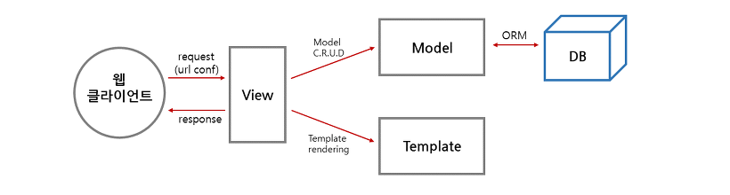

# MTV 패턴   
개발할 때 Model-Template-View 3가지 형태로 역할을 분리하여 개발하는 방법론.
개발 과정이 기존처럼 파일 하나에 다 때려박던 것보다 번거로운건 사실인데, 이렇게 분리함으로써 나중에 관리하기가 편해진다.
기존의 MVC 패턴 -> MTV와 유사    

    

**Model**은 블로그의 내용을 데이터베이스로부터 가지고 오거나 저장, 수정하는 기능을    
**Template**은 출력을 위해 디자인과 테마를 적용해서 보여지는 페이지를 만들어주는 기능을 하며       
**View**는 Model과 Template 사이에서 중계자 역할을 하며 Model이 가져온 데이터를 적절히 가공하여 Template에 전달하는 기능, 즉 버튼을 눌렀을 때 어떤 함수를 호출하여 데이터를 어떻게 가공하여 Template에 전달할 것인가를 결정한다.    

### 처리과정

클라이언트의 요청이 들어오면 url conf 모듈을 이용하여 url을 분석한다 --> 해당 url에 대한 처리를 담당하는 뷰를 결정한다 --> 뷰는 로직을 실행하면서 데이터베이스 처리가 필요한 것은 모델을 통해 처리하고 결과를 반환하여 템플릿을 활용해 클라이언트에 전송할 html 파일을 생성한다 --> 뷰는 최종결과로 html 파일을 클라이언트로 보낸다.

### django 프로젝트 내부 파일 살펴보면          

**models.py** - DB구조를 설계.DB에 접근할 수 있도록 ORM으로 도와줌. 
**templates/.html** - 특정 정보 들어왔을때 사용자 에게 보여줄 내용 정의         
**view function** - 요청을 DB,Template과 연동해서 처리(render함수등 통해 db받아와서 html만듬)   

# MVC 패턴     
**Model** - 내부 비지니스 로직 맡는 역할. 알고리즘, db, 데이터 관리(데이터 or작업 요청만 받아서 자기일만하고 controller에 넘김. 사용자 관심없음)        
**View** - 화면에 뭔가 보여주는 역할.
**Controller** - Model과 View를 연결. 또는 유저와 연결되는 역할. 유저의 명을 받>아 Model에게 일을 넘기고, 그 결과를 View를 통해 보여줌

ex)    
1. 사용자는 Controller에 요청   
2. Contoller는 필요에 따라 Model에게 작업 혹은 데이터를 주어 처리하게함.   
3. 그 결과받아서 View에 전달하여 사용자에게 화면 보여주게함.   

[출처](https://blog.acu.pe.kr/70?category=593618)   
[출처2](https://revidream.tistory.com/16)

