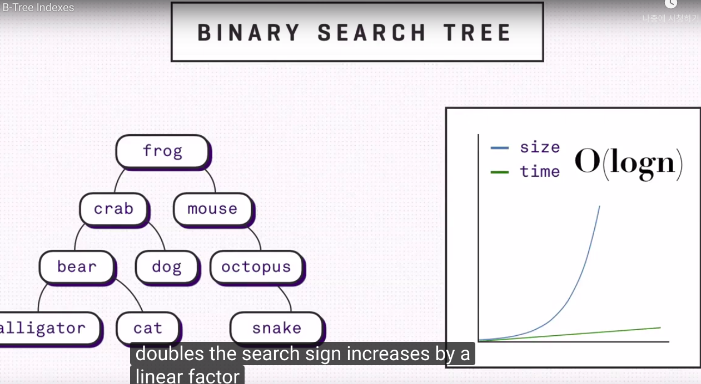

# 데이터베이스 - 인덱스란?    


## 내가 아는거 우선 다 적어봄. 아주 두루뭉실함...    
```
디비에서 인덱스란?  사전적 의미처럼 목차란 같은 기능 
데이터를 저장해놓은 곳을 가리켜주는 포인터 같은것      
자료를 빠르게 찾아가기위해서 미리 구성해 놓은것.   
이진트리나, 이진 힙 같은 자료구조에 비해서 높이 낮아서 빠르게 탐색 가능함.   
(근데 이경우 반대로 같은 래벨안에서 탐색하는 시간이 길어지면 도찐 개찐 아닌가요?)    

자료구조에서 배운바에 따르면 b트리와 b+ 트리를 쓰는데 b트리의 경우 리프노드의 레벨이 다 같아야 한다는 규칙이 있었고   
b+트리의 경우(이건 좀 기억남!) 리프 노드를 제외한 상부의 노드들은 리프노까지 가기위한 경로를 표현할뿐   
실질적인 데이터를 가지고 있지 않다. 실질적 데이터는 모두 리프 노드에 담아져있고 역시 레벨이 모두 같다.  
(마지막 레벨이 다 체워져있는것.) 또한 리프 노드끼리는 연결 링크로 연결되어있어서 빠른 탐색 가능함   
(솔직히 이것의 장점이 뭔지 모르겠음.)      
```     

그래서 내가 모르겠는것. 
1. 인덱스가 도대채뭔지? 내가 본적없는데...? -> DML 공부시 보긴함.   
2. b+,b트리 이점을 도대체 모르겠슴.설명좀...                        
3. 해쉬테이블과의 차이는? 왜 인덱스에는 b트리 쓰지? 각각의 장단점과 용도는?  


## 추가적으로 정보 찾아봄.    

### 인덱스란?  
말 그대로 책의 색인-> 데이터= 책의 내용, 인덱스(데이터 저장된 레코드 주소) = 페이지번호       

DBMS 사용해도 db의 테이블에서 원하는 정보 모든 테이블 대상으로 스캔,검색후 가져오는것 오래 걸림   
columm값, 그것이 저장되 ㄴ주소로 키, 값 쌍으로 인덱스를 만들어 놓고 추후에 이것을 탐색해서  검색 속도 줄일 수 있다.   
(반대로, 삽,삭 에 대해서 인덱스도 최신화 해야 되서 해당 레코드에 대한 성능 떨어짐. 삽삭 수시로 일어나면 인덱스 최소화 하는게 효율적이라함 읽기up, 쓰기 down)    

### 자료구조      

#### b 트리   

B트리는 대용량 데이터 구축하기위해 고안된 자료구조. 하나의 노드에 키를 수천개 넣고 높이를 낮춰서 탐색 빠르게함.  
조건세개 있다.  

차수가 M인 B트리 (차수 = 최대 자식수)   
1) 모든 이파리 동일한 깊이 갖는다.    
2) 각 내부노드 자식수는 M/2 <  자식수 <= M 이하.  
3) 루트의 자식수는 2 이상  


#### b+ 트리      
.jpg)
실제로 가장 널리 활용되는 B트리 키들만 가지고 B트리를 만들고 이파리 노드에 키와 관련된 정보를 저장한다.  
즉 키들로 구성된 B트리는 탐색,삽입,삭제 연산을 위해 관련된 이파리노드를 빠르게 찾을 수 있도록 안내해주는 역할만 수행.  
 또한 B+트리는 전체 레코드를 순차적으로 접근할 수 있도록 이파리들은 연결리스트로 구현한다.  

B+트리 이곳 [참고](https://youtu.be/2q9UYVLSNeI)  
 B+트리의 경우 이파리들이 실제 의미있는 키들을 가지고 있고 그 위의 root~이파리의 부모들은 루트로부터 이파리들을 찾아 내려오기 위해 존제하는 이정표 정도이다.  
값이 새롭게 삽입되면 알맞은 위치의 이파리에 새 값이 놓이게 되고 거기까지 이르는 이정표들도 새롭게 개편된다.  

세가지 규칙     
1) 모든 노드는 leaf에서 부터 시작된다.      
2) 모든 leaf노드는 같은 레벨에 위치한다.      
3) 모든 leaf노드들은 다른 leaf들과 연결리스트로 구성되기위해 link되어있다.     


#### hash 인덱스 알고리즘.        
칼럼 값으로 해시 값을 계산해서 인덱싱.-> 매우 빠르다.(인댁스크기 자체는작음)   
값을 변형해서 인덱싱 해서 인덱싱 해서, 값의 일부만으로 검색하고자 할때는 쓸 수없음.  
메모리기반 테이블에 주로 구현되 있고, 디스크 기반 대용량 테이블에는 사용 x   
(내가 기존에 알던 해시테이블쓰는덧인듯.)   
데이터 ->해쉬함수 거쳐서 -> 실제 래코드 주소 바로 알수있다. (트리 구조 에서는 여러 노드 거쳐야..)   
키,레코드의주소값 저장한 공간이 버킷(비트리에선 노드)    
원래 키값이 아니라 해시한번 거친 키값이 저장되서 길이 많이 줄어듬.    
뭐 알다시피 충돌 많이 발생시 검색 효율 떨어짐.(범위크면 공간낭비, 작으면 충돌..그 균형이필요한듯)   

주로 DBMS에서는 검색위한 index, table의 파티셔닝 용도로 씀(자세히는 모르겠슴)   


[참고](https://12bme.tistory.com/141)


#### 기본 인덱스 (primary index)와 보조 인덱스 (secondary index)의 차이점   
**희소 인덱스, 밀집인덱스**   
희소인덱스 : 각 데이터 블록마다 하나의 엔트리 갖는다.   
밀집인덱스 : 각 레코드 마다 하나의 엔트리를 갖는다.


**기본 인덱스**    
데이터 파일이 키순으로 순차 정렬 되있어야한다.   
일정 레코드의 묶음을 데이터 블록이라정의 , 블록당 하나의 엔트리 갖는다.   
블록당 첫번째or마지막 레코드의 첫번채 필드 값을 탐색 키값으로 갖는다.   
즉 블록당 하나의 엔트리 갖는 희소 인덱스   


**보조 인덱스**
한 파일이 기껏해야 하나의 필드들의 조합에 대해서만 정렬됨   
보조 인덱스는 탐색 키 값에 따라 정렬되지 않은 데이터 파일에 대해 정의됨.   
보조 인덱스는 밀집 인덱스    
같은 수의 레코드들을 접근할때 보조 인덱스 통하면 기본인덱스 통하는 경우보다 디스크 접근횟수 증가함.    


[참고](https://m.blog.naver.com/PostView.nhn?blogId=remocon33&logNo=221037713789&proxyReferer=https%3A%2F%2Fwww.google.com%2F)   
[참고](https://dduddublog.tistory.com/34)

#### 인덱스 조합   

인덱스로 설정하는 필드의 속성이 중요하다. title, author 이 순서로 인덱스를 설정한다면 title 을 search 하는 경우, index 를 생성한 효과를 볼 수 있지만, author 만으로 search 하는 경우, index 를 생성한 것이 소용이 없어진다. 따라서 SELECT 질의를 어떻게 할 것인가가 인덱스를 어떻게 생성할 것인가에 대해 많은 영향을 끼치게 된다.   


### 기타 질문들 

#### b비교한 b+트리의 장점은?  
b트리에서는 leaf,내부 노드에 데이터 저장 가능하지만 b+트리에서는 leaf에만 데이터 저장 가능하다.   
이렇게 각 내부 노드에서 의 데이터 연결을 없앰으로 아낀 포인터를 b+트리는 노드에서 다른 노드 로의 연결에 투자함.  
정확히 말하면 각 노드이 fanout(한 노드의 자식노드) 수 를 늘리고, 결과적으로는 트리의 깊이가 줄어들게 된다.    
그덕에 검색에 필요한 I/O 동작을 줄여서 검색을 더 효율적으로 할 수있음.   

반면 단점은 b 트리의 경우는 트리를 타고 leaf까지 가는 경로 도중에 딱 찾던 값을 찾아서 빨리 끝날 수도 있지만 b+ 트리는 데이터가 leaf에만 있으니 어쨌든 끝까지 내려가야한다는것.(근데 결국은 한노드의 자식노드수 아주 많기 때문에 보통은 leaf까지 내려가긴함. 보통 100 이기때문에 깊이가 3이라하면 leaf단에는 100^3/(100 + 100^2 +100^3) 99%의 노드가 있다.   


[참고](https://stackoverflow.com/questions/870218/differences-between-b-trees-and-b-trees)
[참고](https://ko.wikipedia.org/wiki/B%2B_%ED%8A%B8%EB%A6%AC)

#### 높이 낮은게 장점이라면 b+트리를 리스트가 대처할수는 없나? 인덱스 위해 왜 b트리 쓰는지? 
  
리스트 같은 경우에는 높이 없는데 더빠르지 않나?    
아니다 리스트의 경우 O(N) 즉 최악의 경우 모든 노드들 다 돌아야 된다.  
반면 b+,b트리는 서치 트리 답게 높이만큼 즉 logn 안에 원하는 결과 찾을 수있음. 더빠르다. 
[참고](https://youtu.be/NI9wYuVIYcA)  
위 유튜부 보면 흥미로움(아주아주 좋다.)      

**선형 리스트** 경우 시간 복잡도가 O(n) 인데 이것은 자료가 2배면 탐색 시간도 2배 걸리는것.   
  
시간 복잡도 완화 하기 위해 공간을 희생시킨것이 **binary\_saearch\_tree** 이진탐색트리     
선형리스트와 달리 데이터 저장하기위해 분리된 구조를 사용하지만(근데 결국 저장되는 노드수는 같은거 아님?)     
이경우 우리는 모든 트리(노드)를 돌필요없음. O(logN)으로 자료 두배여도 탐색시간은 선형으로 증가.   
  
하지만 이진탐색트리는 다음과 같이 균형이 극도로깨지개되면 한쪽다 탐사하고도 아무것도 못찾는 경우도 발생.  

이런경우 우리는 노드를 트리에 추가하는 시간을 희생시켜서 추후의 탐색시간을 완하할 수 있음.  
새로은 record 삽입 할때 마다. 모든 branch에서 트리의 높이가 같게 남도록 새로운 root선택하면 되는것.   

하나더 고래해야할게 이것은 생각보다 비용 커서 최대한 적게 수행해야함.  
그러기 위해서 우리는 하나의 노드에 여러 요소를 정려된 상태로 저장해야함. 이것을 page라함.   
이렇게 구성하면 트리를 탐색할때 각 element가 아니라 page자체를 얻기위에 디스크에 접근한다.   
페이지는 limint가 있고 이것을 넘어서면 다른 페이지 로 분화한다.-> 그에맞게 root도 업데이트됨.  
다음 이미지 두개 처럼  

  
이것을 b 트리라 한다.    
모든 insert에서 우리는 b트리의 균형을 맞춰줘야함.(최악의 경우 여전히 O(logN)    

이것보다 높이 낮춰서 발전한것이 바로위 질문의 b+트리이고    


#### 인덱스 위해 왜 시간복잡도 O(1)인 hash table안쓴느지?   
-> hashtable 은 완전 일치 하는 동등연산(=) 에 특화되어있다.   
하지만 SELECT질의 의 조건에는 부등호 연산(<>)도 포함되서. hashtable은 데이터베이스 자료구조에 적합x    
(해쉬같은 경우는 특정 데이터에대해 폴딩, 나누기 등 전처리 해서 대이터의 주소를 바로 도출. 거기로 바로 접근 하기 때문에 O(1)이다.)   

#### 인덱싱 항상 만드는것이 좋은지?   
결론만 먼저 말하면 아니다.   

selct 쿼리성능은 월등히 향상시키지만   
insert, delete, update 쿼리문을 실행할때는 별도의 과정 추가로 발생한다. 
insert경우 -> 새로운것 추가해야함. 
delete경우 -> 안쓰게된것 안쓴다만표시 -> 해당 row 남아있고, 메모리 낭비    
update경우 -> insert + delete 즉 새로운거 넣고, 안쓰게된건 안쓴다만 표시     

또한 데이터 형식때라 인덱스 안만드는게 비효율 적일수도 있음   
이름,나이,성별 세필드를 갖는 테이블 생성할때는 range가 큰 이름만 인덱스 생성하는게 나음.  

(만약 boolean이라면 -> b트리 구성해도 여전히 둘다 방문해야 해서.. 노의미)  


 

[참고](https://github.com/JaeYeopHan/Interview_Question_for_Beginner/tree/master/Database#index)  
[참고2](https://lalwr.blogspot.com/2016/02/db-index.html)     
시나공 정보처리 42장    
