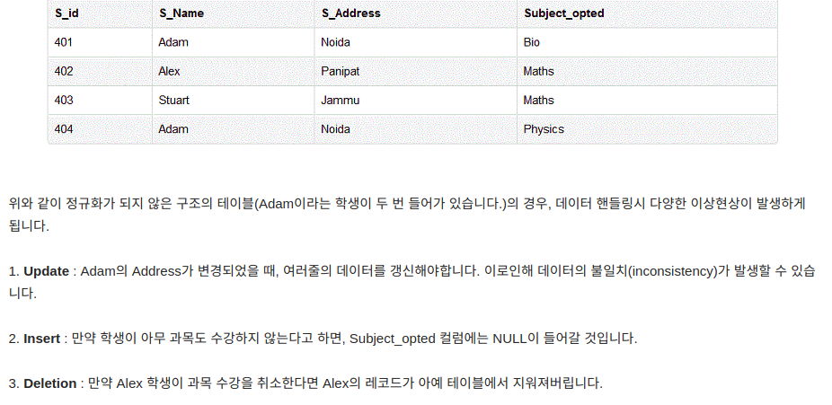
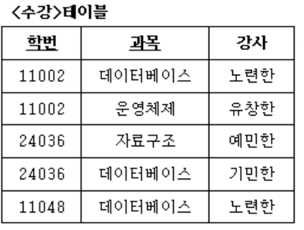

# 정규화      

## 내 머리속에 있는 개념 먼저 꺼내보자.   
정규화란 데이터 베이스에서 일어나는 이상 현상(삭제,삽입 등이 원하지 않는 colum이 같이 된다던지 하는)을 최소하 하기위해 각 테이블 별로 지칭하는 객체들을 명확히 해나가는 과정이다. 중복된 데이터를 찾아서 제거해 나가는과정.  예를들어 학생 테이블이 있고, 교사 테이블이 있는데 이 둘에 교과목이라는 속성이 공통으로 있다면, 학생, 교사 중 한곳에서 교과목 속성의 내용을 바꾼다면, 두 곳에서 의 교과목에 대한 서술을 동기화 하기 힘들것이다. 그렇기 때문에 아예 학생,교사 태이블에서는 그 내용 과관련된 필드들만 선언해 놓고, 교과목 의 경우 따로 태이블을 빼줘서 관리한다.    
정규화는 제 1,2,3정규형, BCNF정규형 , 4,5정규형이 있다.   
제 1 정규형에서는 도메인이 원자값만으로 되어있는 형태.(하나의 속성이 단일값만 갖도록함.)  
제 2 정규형은 부분 함수적 종속성을 갖는 릴레이션을 완전 함수적 종속성을 갖도록 하는것.(즉 모든 기본키가 아닌 모든 속성이 기본키에 대해 완전 함수적 종송.  쉽게 말하면 전체 주 식별자 에 대해 서 만 종속되도록 ~ 결정되도록 하는것.)  
제 3 정규형은 이행적함수 종속성 갖는 것을 제거.(즉 A-> B -> C 식으로 종속성이 테이블 상에 있을때 A-> B , B -> C 이런식으로 테이블을 쪼개준다. )   
BCNF형은 릴레이션의 결정자가 모두 후보키인것(일반 속성이 후보키 결정x )   
제 3 정규형에서 후보키많고 서로중첩되는경우 적용함.   
제 4 정규형은 다치종속, 제 5정규형은 조인종속 만족시에     

역정규형은 정규화로 인해 오히려 디비 참조하는 성능이 떨어질때 함.   
예를들어 자주 같이 쓰는 속성이 두 테이블에 나눠져 있다면 한테이블의 속성으로 다른 테이블의 속성을 가져오는 형태.    


## 이하 내용 처음부터  정리해보겠슴. 

## 1.정규화란 ? 
RDB 설계시 데이터 **중복 최소화**해 각 릴레이션들에서** 이상현상 생기지 않도록 구조화** 하는 과정.   
**하나의 종속성이 하나의 릴레이션으로 표현**될 수 있도록 분해해 가는 과정.      
적어도 3NF가 되야 정규화가 됬다 말함.

## 2.이상(Anormaly)   
한 릴레이션(테이블)에 여러 엔티티(객체)의 속성들이 혼합되면 정보가 중복 저장되며 공간낭비와 갱신이상이 발생하게 된다. 
1. 삽입이상 : 잘못된 정보 삽입   
2. 삭제이상 : 자료포함된 전체 튜플삭제  
3. 갱신이상 : 일부만 갱신  
     


[참고](https://3months.tistory.com/193)    


## 3. 정규화 각 단계   

두부이걸다줘?  = 도부이결다조    

### 제 1 정규형    
속성(에트리뷰트) 의 **도메인이 오직 원자값**만을 포함  
(즉 튜플에 속하는 모든 에트리뷰트가 도메인에 속하는 하나의 값만 가져야함.)      

예시)   

다음을    
       

이렇게 변경   
  
 
### 제 2 정규형     
테이블의 모든 컬럼이 완전함수적 종속을 만족하는것        
즉 기본키중에 특정 컬럼에만 종속된** 부분 함수적 종속이 없어야함.**     
(예를들어 기본키가 두개일때 두 개의 조함으로 (A,B) -> C 이렇게 c가 결정되야 하는데 그렇지 않고 A -> C 이런식으로 한개로만 결정 되면 부분함수적 종속)      

예시)   
다음테이블에선 기본키 (student,subject)두개       
이두개 합쳐야 한 로우를 구분할수있다.     
그런데 Age의 경우 기본키 중 student에만 종속됨.  
즉 student 컬럼값 알면 age값 알수 있어서 age가 두번 들어가는것은 불필요.
     

해결을 위해 테이블을 아래같이 쪼갬. 모두 2차 정규형을 만족.      
     


### 제 3 정규형   
기본키를 제외한 속성들간에 **이행적 함수 종속이 없는것**     
즉 기본키 외의 다른 컬럼이 그외의 다른 컬럼 결정할 수 없는것.   
(이행적 함수 종속: A-> B -> C  이면 A-> C만족하는 관계. 일반적으로 A-> C 바로 만족하지 않고 B를 거쳐서 만족.)     

예시)    
기본키인 학번에 -> 학과명, 학과전화번호 결정되서 제 2 정규형 만족하는것으로보임.  
하지만 학과명 -> 학과전화번호 결정되는데    학과전화번호가 학번에 이행적으로 함수적 종속 하고있는것. (즉 학번 -> 학과명 -> 학과전화번호 이렇게 이행)    
 
수정이상 ->  학과에 학생 수 속한만큼 학과 전화번호 중복.   
삭제이상 -> 학생 한명인 학과 라면 학생 삭제시 학과도 삭제    
삽입이상 -> 학번 이 기본키 구성요소라 학생 한명도 없으면 학과정보 삽입 불가능  

   

이행적 함수 종속성 제거 위해 릴레이션 두개로 분리   


### BCNF(Boyce -codd Normal Form)    
**모든 결정자가 후보키**가 되도록 한다.   
제 3 정규형을 확장.  

예시)  
각 학생은  여러과목 수강 가능하고   
각 강사는 한과목만 가르친다 했을때   
기본는 (학번,과목)이라 했을때     


함수적 종속성은 이렇다.      

결정자          종속자     
(학번,과목 ) -> (강사)   
(강사) -> (과목)    
기본키가 아닌 강사가 가 기본키인 (학번,과목)에 완번히 함수적종속 -> 제 3 정규형 만족   

후보키는?  
(즉 튜플 특정하는 키묶음, 기본키가 될수있는 후보)    
(학번,과목), (학번,강사)    

이때 모든 결정자의 후보키 여부는?      
(학번,과목)  -> 결정자이면서 후보키(기본키이므로)     
(강사) -> 결정자 이면서 후보키 **아니다**       

따라서 <수강> 테이블은 제 3정규형이면서 BCNF아니다.   
(제 3정규형에서 없에는 이행적 함수 종속은  단순히 특정 기본키가 아닌 속성 -> 속성 결정 된다 고 성립이 아니다. 기본키 -> 특정속성 -> 속성 이런식으로 특정속성 이행해서 또다른 속성 종속될때 이행적 함수 종속성 성립하는것. BCNF에서 없에는 결정자가 아니면서 후보키 인것과는 다른것.)      

(갱신이상 분석은 [다음페이지](http://blog.naver.com/PostView.nhn?blogId=jinsol1&logNo=100024338931&parentCategoryNo=8&categoryNo=&viewDate=&isShowPopularPosts=true&from=search) 참조)     

해결책 :     
1. 키가 아니면서 결정자 역할하는 에트리뷰트(속성)과 그 결정자에 종속하는 속성을 하나의 테이블로 구성 -> 이 테이블에서 결정자가 기본키됨.    
2. 기존 릴레이션(테이블) 에서 (키가아니면서 결정자역할하는) 결정자를 남겨서 기본키의 구성요소가 되도록 함.   
3. 또한 이 결정자는 새로운 릴레이션에 대한 외래키 역할 도 함.    


## 4.정규화장점.   
1. 이상현상 제거   
2. 데이터 중복 제거 -> 한 테이블 데이터 용량 최소화 

## 5. 정규화 단점.    
릴레이션간의 분해로 릴레이션 간의 연산 (join연산) 많아짐.-> 이로인해 응답시간 느려질수있음.   
 
## 6. 역정규화(=반정규화)        
정의:   
```  
 정규화로 인해 분해된 릴레이션들에서 정보를 얻기 위해 조인을 사용해야 하는데, 응답 속도가 떨어지기 때문에 정규화에 위배되더라도 성능 향상을 위해 테이블을 다시 합치는 과정  

```  


(다른 이유에서도 한다. 테이블 내 접근수, 데이트량 많을경우등. 또한 더 찾아보면 합치는것뿐 아니라 나눌때도 있음) 

#### 주의점.   
반정규화 과도하게 적용시 데이터 무결성 깨질 수있다.     
반정규화 이전에 다른 방법으로 처리 유도할 수있는지 검토해야함. -> join많은경우 뷰테이블 처리 가능한지 검토   


[출처0]([참고](https://3months.tistory.com/193)  
[출처1](https://yaboong.github.io/database/2018/03/09/database-normalization-1/)  
[출처2](https://github.com/JaeYeopHan/Interview_Question_for_Beginner/tree/master/Database#%EC%A0%95%EA%B7%9C%ED%99%94%EC%97%90-%EB%8C%80%ED%95%B4%EC%84%9C)  
[출처3](http://blog.naver.com/PostView.nhn?blogId=jinsol1&logNo=100024333500&parentCategoryNo=8&categoryNo=&viewDate=&isShowPopularPosts=true&from=search)
