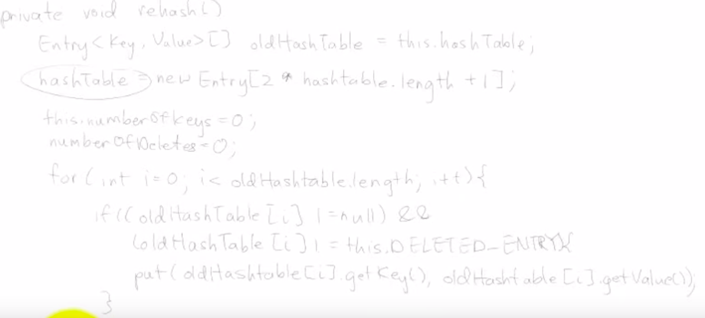

# 19.6.21 xfund  인터뷰 정리(최대한 best로 적어보자.)   
  
## 질문 1.학부 수업중 인상깊은 과목3개만 말해보시오.(개발,프로그래밍 관련 과목만)     
답변:   
1. 로봇프로그래밍: 파이썬 배움,numpy,matplot,opencv,serail통신 모듈 써봄. 프로젝트로는 라즈베리 파이 에 라스비안(파이 전용) 리눅스 운영체제로 깔아서 파이썬 + opencv로 카메라로 움직이는 물체 따라가는 레이저 포인터 만들어봄.      
 
2. 디지털제어구현: 마이크로 프로세서(cpu) 구조 배우고, 어떻게 동작하는지 배움. 버튼 으로 input받고 -> 로직 짜서 -> output led,모터 등으로 특정 로직(폴링,인터럽트등) 작성해보고 해봄. 엘레베이터,최단경로어떻게 찾아가는지 led로 테스트 해봄.      
3. 컴퓨터제어프로그래밍: c#기초로한 수업. 객체지향적으로 특정 주제정해 매주  프로그램 짜오기가 과제로 있어서 재밌었음.(예.중력가속도 적용해서 공튀기기, 그림판만들기, 핑퐁게임, 카드게임, 시리얼 통신 으로 체팅방 구현등)     


자시/수치해석/켑스톤/C/공프/   

추가질문:   
1. 이론보다 실습을 좋아합니까?:     
어떤 목표를 정해놓고, 예를들어 웹페이지를 활용한 작은 서비스를 만들기 라던가 ~ 정해놓고 그것에 필요한 것들을 배울때가 훨씬 흥미롭다. 
   자료구조, 알고리즘,cs 쪽도 거의 프로젝트를 하거나, 프로그래밍 공부를 하면서 궁금했던 것들 을 상세히 알수있어서 재밌다.    

2. 프로그램 처음 해본것은 언제인지?    
3. 컴퓨터공학과 수업을 들은적은 없는지?: 2학년 말쯤에 복수전공을 고민해봤는데 국가장학금이 보장되는 8학기안에 끝낼 수없을것 같아서 필요한부분을 직접 공부하기로함.  

## 질문 2.어떻게 웹 쪽으로 진로를 정하게됬는지?    
답변: 내가 어떤 일을 해야겠다 알게된것은 처음 자소서를 써보면서 임. 학교다니면서 열심히 한것, 재밌었던것 좋았던 수업 이런것을 쓰는데 결국에는 프로그래밍 관련된 과목들이여서 프로그래밍을 하기로 마음 먹음. 그중에서 세부 분야 하드웨어, 웹,게임 이렇게 고민하다가 웹 프로그램 이야말로 실제 사회 어디에나 있고, o2o산업,핀테크 산업 같은 것들이 요즘 뜨는것을 보면 발전이 더딘 하드웨어, 게임 쪽보다 재밌겠다 생각이 들었다.   


## 질문 3.학교 다니는 동안은 프로그램 잘하기위하여 어떤 노력을 했는지?    
프로그래밍 과목을 들으면 항상 프로젝트가 있었는데 그걸 잘하고 싶어서 방학, 학기중에 따로 학습했다. udemy, knook, 생활코딩과 프로그램 서적 을 활용해서 학습 했다. 졸업작품 때도 팀 내에서 이미지 처리 프로그래밍을 맡음.     

## 질문 4.토이프로젝트 소개해보세요.    
답변:      
야놀자 팬션:  
 ios,프론트 등과 협업해서 야놀자 팬션 카피 프로젝트를 만들어봄.   
야놀자 팬션의 기본적인 각 팬션에 대한 뷰, 팬션예약,검색 등에 대한 기능을 구현했고 서버가 클라이언트에가 어떻게 api를 통해 정보를 가공해서 전달하고, 전달 받는지 큰 흐름을 이해할 수 있는 기회였음.       

도서관 영화프로제트:     
서울시에는 총 100개 정도 공공 도서관이 있는데 그중 영화를 주기적으로 상영하는 50개 도서관의 정보를 크롤링 해서 통합적으로 보여주고 유저가 접속한 위치로부터 가까운 곳의 영화들을 우선적으로 보여줘서 유저가 관람하려고 하는 영화를 찜하고 이에대해 알람을 해주는 웹이다.   


추가질문:    
1. 야놀자 펜션 은 공부를위해 만들어본거 같고 도서관 프로젝트는 왜만들었는지?   
2. 도서관 프로젝트 주요 기능은?     
3. 사용자는 몇명?       


## 질문 5. 해시 테이블이란?     
답변:  
**해시란?**    
임의의 길이의 데이터를 고정길이 데이터로 메핑하는 함수가 해시함수      
해시함수에 얻어지는 값이 해시값, 해시코드라 하고 간단하게 해시라함.      
**해시 테이블**     
자료 저장된 위치 빠르게 접근하기 위해 미리 인덱스 구성할때 쓰임.    
키 벨류 형태로 되있어서 해시 함수 통과한 해쉬값을 인덱스로 헤시테이블 에 접근시 실제 데이터 저장된 주소 도출할 수있음.      
(테이블은크기는 고정 즉 배열) 
```  
데이터 -> 해시함수입력 -> 해시값 -> 가지고 테이블접근 -> 실제 데이터 주소 도출   
```  

추가질문:  
1. 충돌이 일어난다면?    
**충돌**: 해시함수 통과한 해시값에 해당하는 인덱스가 가리키는 해시테이블에 이미 데이터가 저장되 있다면. 충돌 일어남     

**해결법 두가지**  
**1.개방주소방식**: 충돌시 테이블에 빈 원소 그곳에 있다면 그곳에 저장 (선형,이차,렌덤조사등으 방법으로 선정)   
**폐쇄주소방식**:  충돌일어나면 해당 인덱스가리키는 해시테이블에 아예 리스트를 만들어 버리는 체이닝 수행. 충돌된키 모두 거기에 저장.   
(즉 배열의 각 원소에 연결리스트를 연결하는것)  


2. 만약 테이블 크기 7인데 15개의 원소가 들어왔다. 이것 어떻게 코드로 구현할지?     
(해시 테이블은 정적으로 메모리 할당된 정적할당 배열이다.)  
일단 말로 설명해보면  
1.기존 테이블의 두배(이경우는4배?) 되는 새로운 배열 만든다.   
2.새로운 해시함수(새로운 배열크기로 만든)으로 기존 배열에 있는 data해시 함수 거치게함   
3.새로운 해시 테이블에 저장.     

코드로 보면?   
  
새로운 해시 테이블을 기존크기 두배+1의 배열로 잡아서 만들고   
기존해시테이블을  for문 돌아가면서 인덱스 i에서 원소가  조건(null아니고, deleted entry가 아닐때) 만족하면 key,value를 새로운 배열에  복사한다.        

->자바에선 키,밸류 entry로 묶는듯.         
deleted entry가 무슨뜻인지모르겠다.     
[재생목록이거] 1~5번 보며 찾아보도록.         

(비슷하게 말한것 같긴한데..직접 구현한다면 어떻게 할것인지반문하심.-> 딕셔너리등에서 어떻게 실제로 구현했는지 찾아보면 좋을것같다.)   

## 질문 6. 사용자가 브라우져가 느리다고 의견 보내면 어디부터 살펴보겠는가?    
내답변:  
나는 eb를 쓰고있는데 ec2의 갯수가 몇개까지 늘어나도록 설정해 놨는지 loadbalancer등을 살펴 볼 것이다. 또한 비동기 처리 되도록 celery 의 worker가 task를 처리하는 경우가 있는데 work의 갯수 재한 또한 살펴볼 것.   

내용추가:      


어떻게 개선할지?:
웹사이트 로딩 속도 결정짔는 요소크게 두가지 **서버속도**, **로드하는데이터**

### 1.서버속도개선.      

**1.django\_orm:**:     
- django-debug-toolbar써서 페이지당 발생하는 쿼리 조회 -> 중복되는것 없앤다.[몽키님블로그참고](https://wayhome25.github.io/django/2017/06/20/selected_related_prefetch_related/)  
- django에서 쿼리셋을 순회하는 시점에서 db레코드를 가져오며 django모델로 변환됨(평가된다한다.) 평가된 모델은 캐시에 저장되는데 if문으로 if Post.objects.filter() 이렇게 하나라도 존재하는지 검사시에도 이것이 캐시된다. 이경우 쿼리셋이 엄층 큰 경우 문제됨. 해결책은 if Post.objects.all().exists()이런식으로 하면 최소 하나 레코드 존재하는지 여부만 체크한다.[너구리님블로그참고](http://raccoonyy.github.io/using-django-querysets-effectively-translate/index.html)   
- db에서 가능한 작업은 진행,사용할 모든값들 미리 쿼리[피플펀드블로그참고](https://tech.peoplefund.co.kr/2017/11/03/django-db-optimization.html)  

**2.db**
- 컬럼 몇개의 데이터 조회후 계산해서 결과 반환하는 과정이 잦다면 아예 계산된 결과를 디비에 저장.  
- db 에 index를 설정해 줘서 자주 조회하는것 접근 빠르게함.   
- 유저가 특정 영역에 lock하는 시간을 최소화.(꼭 필요한 곳에만 하자는것.)  

**2.캐싱:** 
자주 조회되는 api-view에서 돌려주는 데이터를 주기적으로 캐싱해놓는다. -> db조회 안하고 바로 브라우져로 돌려줌.  

**3.비동기처리**  
내프로젝트 메일보내기, 찜하기 처럼 사용자에게는 완료된 모습을 보여주고 celery +메시지 큐 사용해서 요청자체는 비동기적으로 worker들 사용해서 처리    

**4.ec2**  
- 인스턴스 업그레이드
- ec2인스턴스를 과부화 걸리는 시간대에 미리 여러개 만들어놓음

**5.소캣연결재한**  
- nginx프로세스 하나당 처리하는 요청 많아지면 하나의 소캣이 받아들일수있는 연결(디퍼트는 128개)넘어서면 초과되는 접근에 대해서 api 서버까지 접근 허용 안하고 500 에러 리턴한다 -> /etc/sysctl.conf 파일 수정해주면됨.    


### 2.웹사이트 로드 데이터 
크롬 개발자도구 -> 네트워크 텝에서 웹페이지 로딩하는데 가장 많은 시간이 소요되는 구간을 파악.   
응답시간의 80프로는 초기 로딩중 페이지 구성요소(이미지,스타일시트스립트,플레시)등 다운로드에 소요된다.  

1. HTTP요청 최소화     
2. CDN(Content Delevery Network)사용   
3. 상단에 스타일 시트 넣기    
4. 중복 스크립트 제거   
30가지정도 [프론트쪽 로딩관련 참고](https://www.xpressengine.com/tip/22330022) 에 있는데 추후에 꼭 읽어보도록.    


[참고1](https://tech.peoplefund.co.kr/2017/11/03/performance-improvements-of-peoplefund.html)
[참고2](https://www.i-boss.co.kr/ab-74668-700)    
[장고 orm 참고3](https://wayhome25.github.io/django/2017/06/20/selected_related_prefetch_related/)     

## 질문 7. HTTP란 무엇인지? (적어도 2분은 말할 수 있어야 할듯.)     
www상에서 정보를 주고 받기위한 프로토콜(정보교환위한 통신규칙)이다. 주로 HTML문서를 주고받는데 쓰인다.   
클라이언트 와 서버 사이에 이루어지는 요청/응답 프로토콜이다.     

**특징**  
1. connectionless: 연결상태를 유지하지 않는다. 클라이언트가 서버에 리퀘스트 날리고 서버가 응답으로 리스폰스 전송하면 연결을 종료 (소캣을 유지x, 연결 유지위한 리소스 줄이기 위함.) ->  연결이 잦은경우 연결 시도/해제 과정에 오버헤드가 발생. ->  KeepAlive옵션 설정 사용(서버,클라 사이 패킷교환 ㅇ벗으면 상대 안부 묻기 위해 패킷 주기적으로 보내는것.)     

2. stateless: 연결상태(통신) 종료되면  현제 상태가 저장되지 않는다. 서버가 클라이언트 상태를 식별할 수가 없다.(클라이언트가 사용자 인증해도 상태유지 x)  -> 상태를 기억하기 위해  cookie,session사용     


**구조**  
HTTP프로토콜상에서, 클라,서버 사이에서 데이터를 패킷 단위로 쪼개서 통신한다.  
패킷의 구조는 다음과 같음  
```
GET /doc/test.html HTTP/1.1   ->   시작라인(Request Line)  
HOst: www.test101.com         ->    해더(Request Header)         
Accept: images/gif    
Accept-Language: en-us  
Accept-Encoding:gzip  
User-Agent: Mozilla/4.0  
Content-Length: 35   

bookId=12345&author=Tan+Ah+Teck  ->  본문(Body)   

```  
- 시작라인: Request시 메서드요청url,http버전/Response시 http버전,상태코드    
- 헤더 : 요청과 응답 메세지에 대한 추가적인 정보.     
- 바디 : 전송할 실질적 데이터     


(인터넷상에서 운용되는 프로토콜은 그밖에 http, FTP, telnet, ssh등)

[참고](https://victorydntmd.tistory.com/286)  

## 질문 8. 쿠키와 세션이란? 차이는?    
http의 connectionless한 성질에 의한 stateless(서버에 상테 저장x)를 극복하기 위해 도입된 것. 쿠키와 세션으로 서버는 클라이언트의 상태를 기억한다. 예를들어 클라이언트에서 로긴요청을 보내서 서버에서 인증이 됬다면 서버는 세션을 생성해서 세션 id를 쿠키에 저장해서 클라이언트에 보낸다. 클라이언트는  서버로의 리퀘스트에 쿠키를  담아서 보낸다. 리퀘스트 받은 서버가 쿠기에 담기 세션id와 서버 저장공간 담긴 세션 id비교해서 유저 신원 확인및 로긴 상태 유지 됬음을 확인한다.     

차이점:  
1. 저장위치 : 쿠키는 클라이언트, 세션은 서버저장.  
2. 저장형태 : 쿠키는 텍스트 형식(키,밸류), 세션은 object형으로 메모리 저장   
3. 만료기간. 쿠키는 브라우저 종료시 소멸. 세션은 정확한 시점x(클라에서 로그아웃, 일정시간 동안 클라이언트측 만응x일때 만료)   
4. 용량 : 쿠키는 도메인당 20개, 세션은 제한 x  
5. 속도 : 당연히 브라우저 입장에서 쿠키 정보 가져오는게 빠름, 


## 질문 9. 웹프로그래머로서 당신의 장점은?(객관적인 스킬set을 물어봄)        
1. django, drf-api:        
mtv기반으로 장고 앱 개발을 자주 해봤다. 전체적인 구조에 익숙하다.    
drf로 api서버 개발해봤고  그것을 사용하는 클라이언트 웹도 만들어봐서 웹 api를 를 클라이언트 입장에서 어떤 식으로 가져다 쓰고, 서버입장에서는 어떻게 제공하는것이 편한지 알고있다. 

2. AWS: 전체적인 클라우드 배포 작업에 익숙하다. 개별적인 ec2를 할당해서 기포부터 배포하는것과, eb를 이용해서 서버 부하에 따라 ec2갯수 동적으로 조정되도록 배포하는것을 해봤고, s3,rediscahce,rds등을 서버배포에 활용할 줄 안다.   

3. 환경나눠서 개발 해봤음.   
브랜치 관리:   
 dev,master브랜치로 나눠서 작업을 관리했고, dev환경에서 개발을 진행하고 테스트를 해보고 검증된 코드를 마스터에 합병해서 배포를 진행했다.    
팀개발 환경에서는 organization만들고 중앙 원격(remote)저장소 먼저 만들고  
개인 local저장소 dev브랜치에서 작업후 push -> 내 원격 저장소 에 push된 코드 저장된다.  -> 이코드를  중앙 원격 저장소(remote)에 dev 브랜치에 pullrequest  -> 저장소 운영자가 검토후 merge한다. ->  dev브랜치의 변경사항을 master브랜치에 머지 해서 최종적으로 그내용을 배포    

환경변수 관리:  
local, dev, production 작업 특성에 맞게 app/config 에서 환경변수를 분할해서  관리했다.   

보통 local에서는 인터넷과 연결안된 상황에서 작성한 view 나 api-view들이 잘 동작하나 확인하는정도 빠르게 해볼때 runserver해볼 용도 사용함. 로컬에 저장되는 sqlite쓰고 로컬에서 실행되는 redis를 메시지큐로 설정해 주고 있다.    

dev환경에서는 최대한 production 환경과 동일한 상태로 개발을 진행할 목적으로 운영했고, 배포환경과 개별적인 rds, redis,s3를 사용했다. 또한 개발에 유용한 django\_extension 등의 툴을 dev환경에서만 인스톨 하도록 했다.    

production환경 에서는 대부분이 dev의 환경변수와 유사했고, 추가적으로 sentry를 설정해줘서 배포및,유저사용시의 에러를 보고하도록 했다.    


4. +로 CI 툴 써봤고, ORM최적화 해봤다 하면 좋을것같다.-->빨리좀 잘해보자..하고나서여기 정리하자. 

### 고찰. 
1. 면접자는 친절하지 않다. 내 탠션이 더 높아야 함. 
2. 면접자는 자소서와 관련된 질문을 하지만 잘 읽지 않고 관심이 없다. 한눈에 중요한 정보만 잘보이게 쓰면 된다.  -> 상황이 나쁘지 않은게 이것을 역이용해서 질문 유도하고 그것을 철저하게 준비하면 된다.    
3. 직무와 관련된 것만 자소서에 쓰면 충분하다. 그것외에는 관심 없다.   
4. 인터뷰 동안 자아가 붕괴 되는것 같지만 나중에 다시 내 답변을 들어보면 생각보다담백하니 괜찮다. 그러니 답변하나 못한것은 잊고 그다음 질문에만 집중하자.  
5. 평소 공부시 핵심 내용은 O(1)에 접근 가능하게 저장해놓아야 한다. 탐색을 O(N^2)으로 해버리면 이런 답변은 절대로 못한다.  공부를 깊게 파는것은 좋고  핵심을 몇줄로 요약해 놓도록 하자.      
6. 아무리 커널안에 정보를 쌓고 로직으로 돌리고 있어도 Applicatoin 계층에서 다른 프로세스와 최종적으로 통신을 완료하는게 중요하다. 이것은 반드시 연습하고 키워야 한다.   
7. 면접은 게임이다. 내가 전적으로 관찰 대상이지만 내게도 패가 있다. 그것을 잘 활용하고 게임 전체를 운영을 잘해야함.       
8. 한주에 면접하나 목표잡고 ->  공부,정리,빡세게  -> 고찰 -> 다시 도전 계속 이렇게 하면 결국에는 합격할수밖에 없겠다.      
9. 할것 같습니다 는 안좋다. 합니다.라는 말로 완결.   
