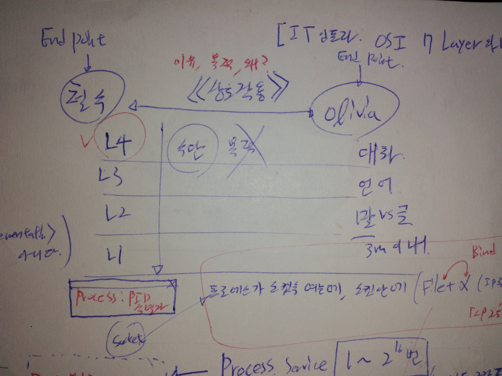
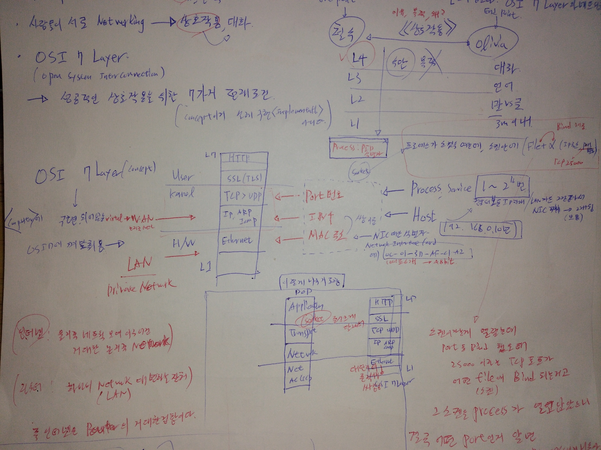
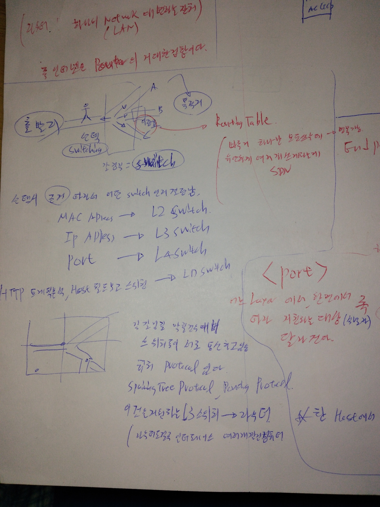
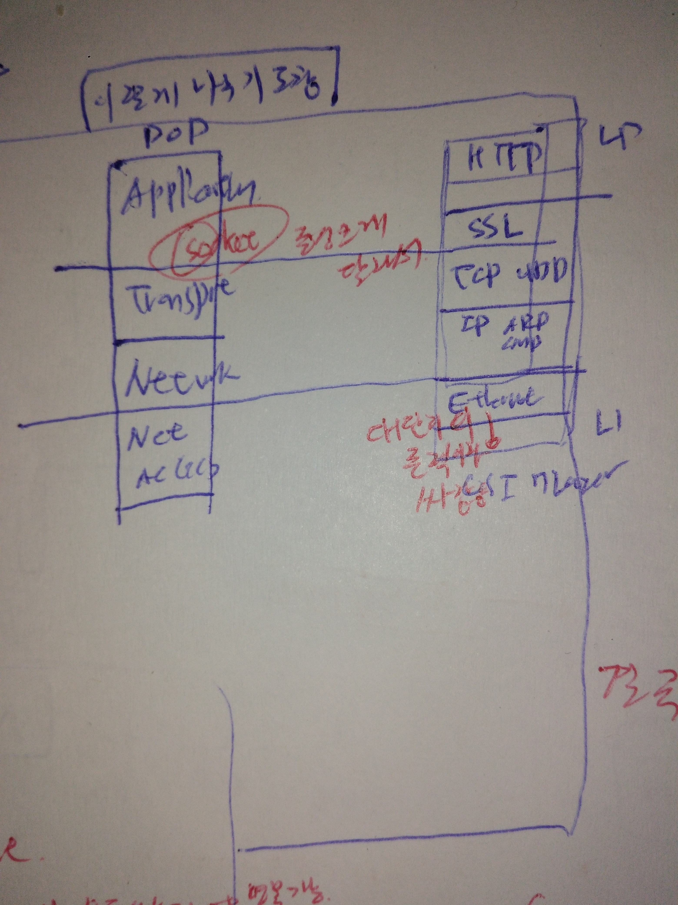
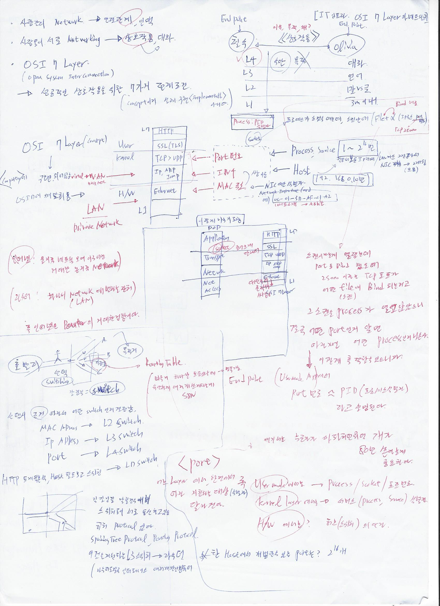

# OSI7계층과 네트워크   
[이호성 강사님의 유튜브 강의 보고 작성중](https://youtu.be/LUTKYykw0Yw)  

- . 사람간의 network란? -> 연결관계 인맥. 사람들이 서로 networking한다면 -> 그것은 상호작용,대화 이다.   
- . OSI7Layer(Open system interconection)은 성공적인 상호작용을 위한 7가지 전제조건.(concept이지 실제 구현implementation아니다.)    
     

- 철수와 올리비아가 상호작용을 하는 경우를 보자. 대화라는 상호작용을 하려 한다면 대화를 위해서는 언어라는 것이 필요, 언어는 말or글이라는 형식이 필요 , 그리고 이것은 3m이내라는 공간적인 전제도 필요하다.  이것을 각각 레이어로 나눠보면 위 그림과 같다. 우리는 지금 명백하게 대화 의 내용이 아니라 수단에 대해 이야기 하고 있는것.  대화즉 상호작용 잘하려면 이런 부분을 사전에 잘 맞춰두고 있어야 할것. 이유,목적,왜는 빠져있음.        

  
- osi 7 layer라는 컨셉이 컴퓨터에 어딘가에 구현되어 있음    
- usermode, kernel, h/w에 osi 7layer 껴맞춰 보겠슴.       

- 7층 HTTP    
- 5층 ssl(tls)  
- 4층 tcp,udp                                   -> port번호  
- 3층 ip,arp,icmp -> WAN  (virtual이다.)        -> ipv4주소  
- 2층 이더넷      -> LAN(Private network)       -> mac주소  
  
  
- 인터넷 -> 물리적 네트워크 모여 이루어진 거대한 논리적 network    
- 라우터 -> 하나의 network(lan)대변하는 장치     
- 즉 인터넷은 라우터의 거대한 집합이다.      
 
- mac주소, ip주소는 보통 쌍을 이룬다.     
- 이것들은 모두 ( ) 에 대한 식별자다.        
- mac주소 -> NIC에 대한 식별자.( 00-01-3d-ad-01-a2 16진수6개 ->  48비트)    
- ip주소  -> HOST에 대한 식별자. (192.168.0.10)   
- port번호 -> process 에 대한 식별자 (1~2^16번)    

- 프로세스가(주체)  실행중이라면 소켓을(대상) 열어야 함    
- 소켓은 기존의 파일 정보 +a (ip, port번호(tcp25000)) 이것을 bind해준다.      
- 소캣이라는게 열렸는데 prot등 bind했을때 25000이라는 tcp 포트가 어떤 file(소캣)에 bind되는거고 그 소캣을 process 가 열고 있으니 결국 어떤 port인지 알고 따라가면 어떤 process인지 나온다.-> 이런식으로 추적 할 수 있으니까 port번호 ~~pid(프로세스식별자)라고 설명된다.     

- port라는게 어느 layer에서 어느 환경에서 인지에 따라 지칭하는 대상 달라진다.   
- usermod -> process/socket/포트번호   
- kernel -> 서비스(process,serverss)식별자   
- H/W -> 허브 스위치의 단자.(물리적으로 우리가 보던 그 공유기 포트)     

  
- 스위치라는말. 많이 들어봤는데 스위치가 뭐지?    
- 스위치는 갈림길에서어디로 갈지 선택하는 주체이고 선택을 스위칭 이라한다.   
- 이때 이정표를 routing table이라함.  
- 보통 스위칭할때 가장 빠른길만 모두다 쓰는데 병목이 가능하다 -> 유연하게 병목피해 여러개 쓰는게 SDN   
- 갈림길에서 경로 선택시 근거 따라서 어떤 switch인지 결정남   
- mac adress -> l2스위치   
- ip adress -> l3 스위치   
- port 번호  -> l4스위치   
- http 트레픽분석, host 필드 보고 스위칭시 -> l7스위치      

- 갈림길이 막혀있을 경우 대비 해서 스위치들이 서로 통신하고있음.이때 protocol -> spaninng tree protocol 등을 지원하는 게 l3스위치 즉 라우터.(라우터도 결국은 이런 인터페이스 여러개 깔린 컴퓨터.)        

-다음과 같이 7계층 나누기도함.   
  
소캣이라는게 큰 구분이라 그 위로 다 싸잡고, 이더넷은 1계층에 크게 의존적이라 1계층과 싸잡음.     

