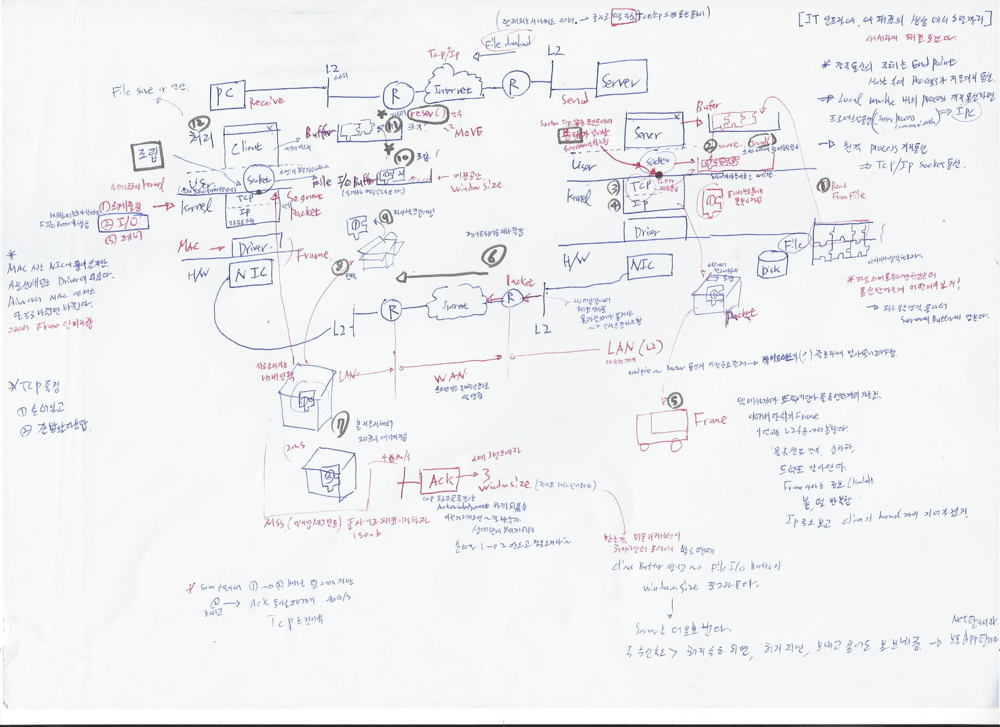

# 패킷     
[최호성 강사님의 유튜브 강의 보고 작성중](https://youtu.be/5Zos_jr7eG0)     

    
- 비유적으로 패킷에 대해 먼저 말해보겠다.   
- 철수내집에서 영희내 집으로 택배를 보낸다해보자.  
- 철수는 선물을 그냥 보내지 않을것이고 뽁뽁이를싸고 빡스에 넣고 송장을 붙여서 보낼것이다.     
- 송장에는 수신자의 이름,주소가 들어있을 것이다.     
- 이때 철수 집은 현관을통해 나갈 수 있고         
- 택배사의 트럭을 통해서 영희내 집까지 갈것이다.      
- 영희네집 앞에 도착한 택배는 영희 엄마에 의해 검사 당할 것이고        
- 별 문제 없다면 영희에게 선물이 도착할 것이다.     

- 이것을 네트워크적으로 한번 다시 보자.     
- 철수(process) 내집(host)에서 영희내 집으로 택배(packet)를 보낸다해보자. -> 그사이의 경로는 network, 택배안의 선물은 payload   
- 철수는 선물을 그냥 보내지 않을것이고 뽁뽁이를싸고(segment화)  빡스(pacekt에 담음. header + payload) 에 넣고 송장을 붙여서 보낼것이다.   
- 송장(header)에는 수신자의 이름(port번호),주소(ipv4)가 들어있을 것이다.  
- 이때 철수 집은 현관(nic or gateway) 을통해 나갈 수 있고  
- 택배사의 트럭(isp인터넷 서비스 프로바이더) 을 통해서 영희내 집까지 갈것이다.  
- 영희네집 앞에 도착한 택배는 영희 엄마(firewall)에 의해 검사(packet filtering-> 헤더만 보고 결정.) 당할 것이고 - > payload까지 열어서 본다면 dpi( deep packet inspection) 그려면 엄마는 IPS(interation prevention system)    
- 별 문제 없다면 영희에게 선물(payload) 이 도착할 것이다. -> 이때 header보고 어느 process에게 보낸것인지 알아내서 보낼것.     
- 이때 보내는 패킷에 대해 좀더 자세히 알아보자.   
- 패킷의 크기는 MTU(Maximum Transport Unit 1500 바이트 밖에 안됨. 물류 단위.     
- 패킷이라는 말만 나오면 ip 즉 l3 ,l4 인 tcp와 같이 놀아서 붙여서 tcp/ip라 일컫는 것임.  
- 패키징 하는 과정을 incapsulation 이라함.   
- header+ segement  40, payload 1460   
- payload안에 http해더 들어있을수있음(상위계층의해더)->그럼 거기까지가 l7, 거기까지가 해더 되버림     

- Firewall은 헤다만 보고  -> spi(shallow packet inspection)      
- ips는 싹다봄  dpi(deep    
- 150비트 만 보고 바이러스인지 알아야 하는데.. 탐지규칙등 만들어서 조사하기 어렵긴하다.   

   

- 결국통신의 주체는 endpoint host속의 process가 지들끼리 통신
- local mahcine내의 process끼리 통신하면 -> 프로세스간 통신(inter process communication) -> ipc
- 원격 process끼리 통신 -> tcp/ip 통신

- 전체 시나리오는 서버에서 파일 다운받는데 이것을 tcp/ip통신을 통해 받는것
- pc는 receive, server는 send 하는데 r2스위치  -> 라우터  -> 인터넷(tcp/ip?)  을 거쳐간다.   

- 좀더 자세희 보내는 서버쪽 부터 알아보겠다.   
- 디스크에 파일이 저장되있는 상태.   
- 1.파일 서버로 부터 다운 한다는것은 통신 관점에서는 어떤 의미 인지. -> 먼저 파일 일부 영역 뜨어서 서버의 buffer에 담는다.  
- 2.파일 버퍼의 파일조각을 socket버퍼에 move,send()함수 통해 담는다.(write)    
- 소캣과 kernerl(tcp)이 맞닿는 부분에서 분해가 일어나고 segment화 가 일어남.   
- 4.이때 tcp는 각각의 조각에 번호를 붙이고 뽁복이 작업을 한다.   
- ip계층에서는 박스에 넣어서 포장을하고 송장을 붙인다.  
- 5.택배 아저씨가 트럭에 담아서 물류센터에 이것을 먼저 보내는데   
- 이때의 단위가 frame 이고 이 단위는 l2수준에서 논한다.    
- 물류센터 도착후 상하차 및 트럭을 갈아탄다.   
- frmae이라는 정보(header)는 붙고 떨어지고를 반복한다.   
- 여기서 부터는 ip주소를 보고 client의 kernel까지 기어가겠지?   
- 6.이때 라우터(물류창고) 까지의 network를 LAN(L2)이고 ROUTER-> INTERNET -> ROUTER 까지의 경로가 wan 이다.(인터넷망은 논리적인 연결로 설명이됨.)    
- 라우터 입장에서는 패킷 단위로 통과 할꺼냐 말거냐가 결정될 뿐 - > 인라인 장비라고 한다.   
- 블라블라해서 결국은 패킷이 클라쪽 l2스위치 까지 왔다.   

- 이제 클라이언트의 계층을 타고 올라가면서 언팩을 한다.   
- 7.이때 mss(맥시먼세그먼트) 풀사이즈 페킷 1500비트 짜리 두개 받은 뒤 클라이언트에서 서버로 ACK(Acknowledgement)를 보내게 되있다. 이제 3번 보내라 보내고 이걸 받은 서버는 1,2순서대로 잘왔다는 것을 알 수있음.  
- 이때 받는쪽 클라이언트 쪽  application 이 처리하면서 동시에 받을텐데 client버퍼에 쌓이고  File I/O Buffer의 windowsize(여분공간) 이 쪼그라든다. 이때 서버는 windowsize공간을 ack통해 체크해서 1460비트 보다 부족하면 더이상 못보낸다.  
- 즉 수신속도 > 처리속도 되면, 처리지연 즉 보내고 싶어도 못보내줌.(이럴땐보통 network탓이 아니라 app탓이다.)   
- 8.l2에 도탁한 페킷을 언팩해서   
- 9.하나씩 끄집어내고   
- 10.이것을 socket과 TCP 닿는 포인트에서  socket의 File I/O Buffer에 넣으면서 조립한다.     
- 수신의 주체는 커널이라 볼수있다.(보통 커널은1.스케줄링,2.I/0,3.제어를 담당함) 네트워크에서 정보가 날아오면 F I/O Buffer에 쌓임.(이 버퍼는 실젤는 커널 안에 존제할 수도 있음) 
- 이때 언페킹및 조립하는 과정에서 NIC,Driver에서는 Frame단위, IP에서는 Packet단위, TCP에서는 Segment단위 가 된다.  
- 11.Socket file I/O Buffer에 쌓인 파일조각을 resev()함수 통해서 cleint process안의 메모리 즉 Buffer에 쌓인다.  
- 12.client process는 File save, 연산 등의 처리를 한다.   

- Mac주소는 NIC에 들어있지만 사실상 세팅은 Driver에 들어있다. Driver에서 Mac 어드레스 딴걸로 바뀌면 바뀐다. 그레서 Driver,Nic을 Frame단이라 한다.  

- TCP의 특징 -> 순서있고, 잘 받았다 응답한다.   

- 서버 입장에서 Packet하나하나 보내는 시간은2ms이지만 도착한 패킷이 클라이언트의 계층을 타고 올라가서 file i/o buffer의 windowsize를 체크하고 ack를 보내고 이것을 서버가 받는데 까지 40ms 걸린다. 이것이 tcp가 느린 이유 

