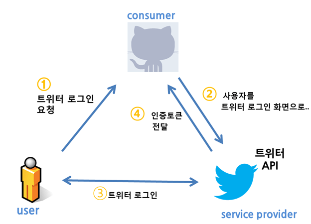
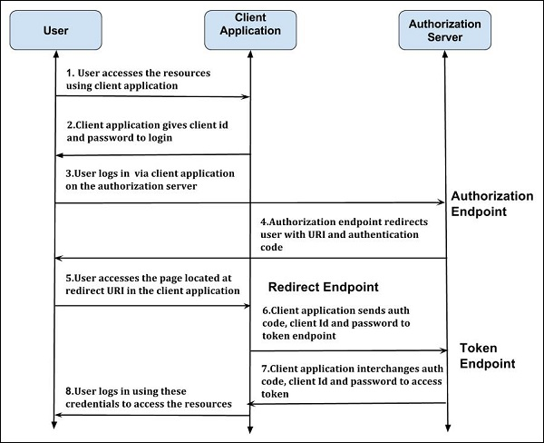

# 소셜 로긴 과정       

        
```

consumer-->내가 만든 사이트.
serviece proviedr-->인증요소 가져다쓰고싶은 카카오등.

사이트에 유저를 가입시킬때 우리가 가진 인증정보를 쓰는것이 아니라
트위터 등이 가진 인증정보를 쓰고싶은것.

특정유저가 트위터의 유저인지 알고 싶다. -->유저의 id, 비밀번호를 알면쉽다.--> 이경우 보안상 큰 문제가 있다. 개인 sns정보 모두 가진것.
사이트가 피싱사이트였다면 이경우 날리가 난다. 트위터 입장에서도 그렇게 주기 싫다.

그래서 어떤개념을 쓰기 시작했나?
우리의 사이트에서 페이스북 로그인을 누르면
페이스북 사이트로 연결을 해준다.(우리사이트를 통해서.)
트위터에서는 ' 너 트위터 로그인 하는데 이 사이트에 이런저런 권한을 줘도 되겠니?'-->확인--->(아이디 페스워드말고) 그사람에대한 특정 권한가진
값(인증토큰: 세션~유저 공부할때 장고로부터 웹브라우져-클라이언트. 에 세션키 받아놓고  로그인 유지 시켜주던것과 비슷한것. )을 사이트에 넘겨준다. 
여기서도 비슷하게 특정 인증토큰 만들어놓고 자기의 데이터베이스와 연결시켜놓음 토큰---어떤 권한.
받은 인증토큰 가지고 다시한번 우리사이트는 요청 할 수있다.
나는 ~이런 토큰 가졌는데 로그인 시켜줘라.
트위터에서 토큰 확인해보니 이 토큰의 유저는 나산마로야 라고 알려준다. 
그러면 그 토큰을 가지고 우리는 이 유저가 어떤 트위터 아이디 쓰고 있구나 알 수 있다. 
우리는 그 인증에 성공한 유저를 가지고 새로운 유저 생성해서 우리 db에 가지고 있어야 한다. 
즉 우리쪽에 있는 어떤 유저와 트위터의 유저가 1:1 로 연결이 되는것.
그 연결을 중간에서 중계해주는 역할이 인증토큰. 

```  




### 페이스북 로긴 과정 상세히 보자.       

1. AnonymousUser가 페이스북 로그인 요청
2. 우리 사이트에서 페이스북 로그인 페이지로 redirect시켜줌.(우리사이트가 해줌.) 
3. 유저가 해당 사이트에 비번 치고 로긴    
4. 페이스북 로그인이 완료되면 인증토큰(auth\_token)을 우리사이트로 다시 redirect시켜줌(페이스북이 해줌.)
4. 받은 토큰을 페이스북api를 사용해서 액세스토큰으로 변환.
5. 유저는 redirect uri 에 우리가 입력해 놓은 대로 우리 엡으로 접근함.   
6. 우리는 받은 authcode, clientidm secreet-->(요청은 우리 사이트 말고도 다른 사이트에서 올수도 있다.  secret값은 트위터 데이터 의해서 우리만 알고있는특정한 값. 우리가 보낸 요청이라는 것을 트위터 측이 알게해줌.) 을 서버에 다시 보냄     
7. authorization 서버는 액세스토큰  을 우리에게 보내줌.     
8. 유저에 특정 정보(resource)에 접근할수 있는 신임장(credential)을 얻은것.    

9. 엑세스 토큰으로 우리는 유저에대한 정보를 서버에 요청해서 받아올수 있는 상태가 된것.(유저가 허용한 이름, 메일등의 특정 정보만)   
10. 받은 유저정보를 사용해서 우리 사이트의 User를 생성.    


### 이전에 구글로긴 하던것 회상 해봄     
```
과정 대략 이랬다.  
유저 가 링크 클릭
        1.      https://accounts.google.com/o/oauth2/v2/auth?scope=https://www.googleapis.com/auth/userinfo.profile&redirect_uri={{google_redirect_uri}}&response_type=code&client_id={{google_client_id}}
             (이때 우리 뷰로 안가고 구글 api 서버로 간다. <리소스 서버> 이때 redirect_url = def googlelogin(), client_id 담아서 요청)  
        2.  정보제공 동의 페이지 페북에서 띄워주고 유저가 수락  
        3.  우리 googlelogin 함수로 code담긴 response redirect되서 온다.   
        4. code,client_id, secret, redirect_url 담아서 ('https://www.googleapis.com/oauth2/v4/token)에 요청 보낸다. 
            (앞서서 code를  우리 client_id넣어서  받았기 때문에 
                code에는  너는 정말 우리 api에 등록된 사람이 맞냐? 라는  질문이 대략 들어있을 것이고 
                우리는 이번 요청에서 그 대답으로id, secretkey다 보내줌)  
           (왜 이런 과정 필요했는지?   일종의 악수 과정. 
          한번에 엡아이디 + 시크릿 해서 로긴하듯이 접근 할 수도 있겠지만  이경우에는 우리쪽에서 요청을 탈취당해서 털릴 수 있다. 
          저쪽에서는 app_id와 연관된 뭔가를 code에 담아주고 그 code와 app_id,secret을 다시 저쪽에서 받게되면 우리라는게 확실해지고   
          그때서야 resource접근권한이 있는 accesstoken주는것이다.)             

        5. access token 을 response로 서버에서 보내줌.
             다음번에는 이것만 가지고 한번에 resource-server에 로긴 가능. 
            (만료기간 짧고, 이미 토큰에 특정 권한만 들어있어서(프사, 성별 등 프로필정보) ~ 탈취쉬 위험 작다   
              최초 같이 발급받은 리프레시 토큰+ app_secret으로 재발급 가능(리프래시는 한번만준다.)  

```
