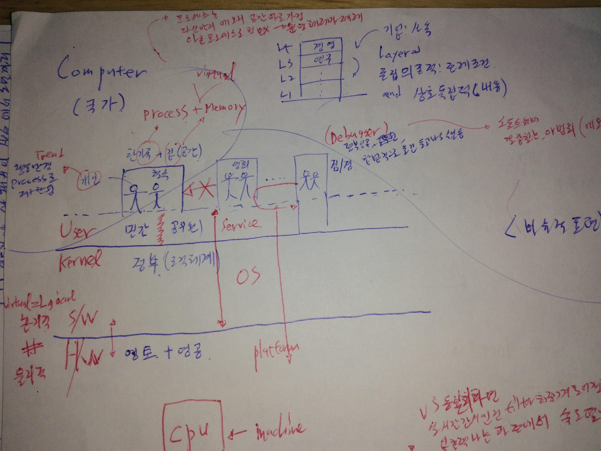
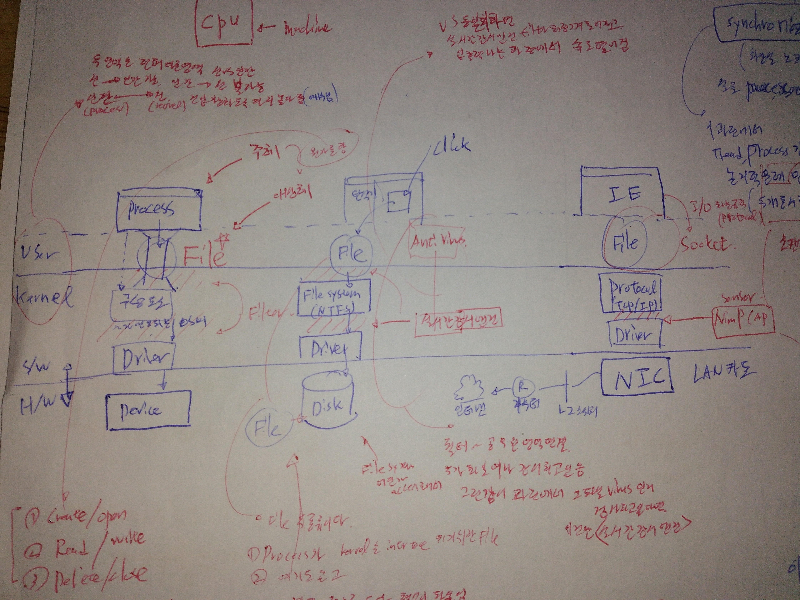
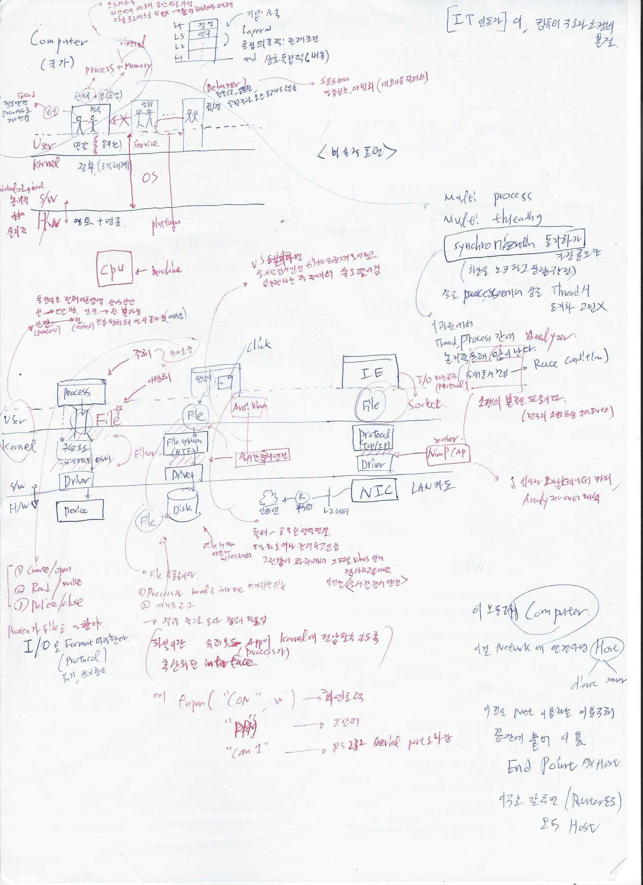

# 컴퓨터 구조와 소캣의 본질   
[최호성 강사님의 유튜브 강의 보고 작성중](https://youtu.be/LUTKYykw0Yw)   

### 먼저 위에 그림을 보겠다.   

  
1. 기업의 사옥을 보면 각 층마다 담당하는 부서가 자리함. 연구부서,경영부서 등등. 각각의 레이어는 존립 의존적이다. 그리고 각 층은 아래층이 전제조건이다. 또한 내용적으로 보면 상호 독립적임.  
2. 컴퓨터를 국가에 비유해 보면 하드웨어->영토, 소프트웨어(커널)->정부(조직체계), 소프트웨어(유저모드)-> 민간or공무원단체, 프로세스+ 메모리 -> 한가족 + 집, 스레드 -> 개인    
3. 영토와 정부 즉 H/W와 S/W의 경계를 주목해보면 이경계는 물리적인것과 논리적인(logical = virtual)의 경계임.   
4. 개인즉 thread의 행동반경은 가정즉 process로 재한됨. 보통은 철수내 집을 영희가 맘대로 침범 못함.   
5. 하지만 검경의 경우 합법적으로 정부인증받아 남의집 물건 들고나올수 있음 -> 이경우가 디버거이고 소프트웨어 결함찾거나 메모리 뒤져서 범죄에 악용 될 수도 있음      
6. Multi process와 Multi threading에선 동기화가 중요하다. 실제로 화장실 노크하고 문잠구는 것고 같다.(싱글 process, 싱글 thread시 동기화 고민 x)  이 과정에서 thread,process 간에 논리적문제 (두개 겹쳐서 race condition)등 많이 일어난다.   

### 두번째 그림 보겠다.   
  

1. 맨좌측 기둥을 보면  하드웨어 에는 Device, s/w(kernel)에는 장치를 다루는 Driver. os같은 구성요소가 자리함. User 영역 위에는 process가동작하고 잇음.  
2.  여기서 User영역과 kernel영역은 전혀 다른 영역이다. 신 과 인간의 영역처럼 신 -> 인간이 접근 가능하지만 인간 ->신영역 접근 못한다.  인간(process) -> 신(kernel)영역 진입하게 다리를 놓아주는데 예수님(file)이 그것이다.   
3. 여기서 주체인 process는   대상체인 file에 뭔가를 한다. create/open, read/write, delete/close  등. process가 file을 ~` 한다. 즉 I/O를 각 format(protocol)따라 수행한다.(파일이란 유저모드 app이 kernel에 진입할 수있도록 추상화된 interface이다. 예를들어 fopen('con',w')-> 화면출력, fopen('prn','w')->프린터, fopen('con1','w')->rs232 serial port로 통신 등 커널에 접근함)  

4. 중간 기둥을 보면 이번에는 디렉토리 창을 켰고 클릭해서 디스크(device)에 파일을 저장하는 경우를 생각해 보자.     
5. 이경우 쓰이는 구성요소(os)는 File system이고 filesystem과 process사이에는 아까처럼 file이 다리 역할을 하고 있다.   
6. 이경우 파일은 filesystem이 disk에 access해서 저장하는 파일과, 5번에서말한것처럼 process와 kernel을 interface하기위한 파일 두종류가 있다. 결과적으로는 둘다 형식이 파일이다.   
7. 여기서 아까의 검/경 처럼 유저모드의 antivirus는 kernel영역의 실시간 검색엔진을 통해 file-> filesystem -> driver사이의 필터를 감시한다. 누가 파일을 여는지,저장되는 파일이 바이러스인지 등을.    

8. 세번째 기둥을 보면  인터넷창을 열고 인터넷에 접속하는 경우를 생각해보자.   
9. 이경우 I/E은 I/O 하는 규칙인 protocol을 통해서 socket 파일에 기록을 하고 이를통해 kernel영역의 구성요서인 tcp/ip에 접근한다.(소캣의 본질은 즉 파일이고 전구의 소캣처럼 인터페이스이다.)  
10. 하드웨어 영역에는 NIC카드가 있고 이것은 l2스위치, 라우터 ->인터넷 순으로 연결된다.    
11. 여기서 유저모드에 analyzer를 두고 kerneal의 numpcap(sensor)를 이용해서 driver, protocol(tcp/ip)사이의필터를 관찰해서 위아래 오는 데이터를 카피및 해석 할 수 있다.     

12. 앞선 3개의 기둥같은 모든게 컴퓨터 이다.   
13. 이것을 네트워크에 연결하면 호스트 이다.(client, server 둘다 host)  
14. 이것은 net을 이용하는 주체. 끝단에 붙어서 이용하기 때문에 endpoint라 한다. (endpoint ~ host)   
15. 이런 구조 갖추면 router든 뭐든 다 host이다.      

